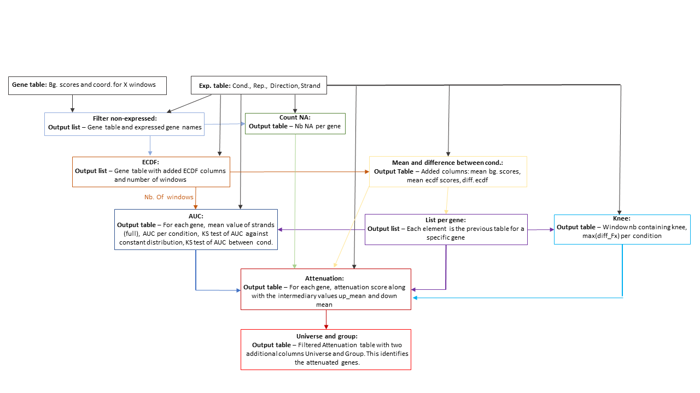

# TepR: Transcription elongation profile in R

I. [Description](#description)
II. [Installation and requirements](#installation-and-requirements)
III. [General principles](#general-principles)
IV. [Tutorial and quick start](#tutorial-and-quick-start)
V. [Getting help](#getting-help)
VI. [Credits](#credits)

## Description

TepR (Transcription Elongation Profile in R) is an R package designed for analyzing data from nascent RNA sequencing technologies, such as TT-seq, mNET-seq, and PRO-seq.  It calculates the probability distribution of nascent RNA sequencing signal across the gene body or transcription unit of a given gene.  By comparing this profile to a uniform signal, TepR can identify transcription attenuation sites.  Furthermore, it can detect increased or decreased transcription attenuation by comparing profiles across different conditions.  Beyond its rigorous statistical testing and high sensitivity, a key strength of TepR is its ability to resolve the elongation pattern of individual genes, including the precise location of the primary attenuation point, when present.  This capability allows users to visualize and refine genome-wide aggregated analyses, enabling the robust identification of effects specific to gene subsets.  These metrics facilitate comparisons between genes within a condition, across conditions for the same gene, or against a theoretical model of perfect uniform elongation.

## Installation and requirements

TepR requires R version 4.4 or later. Installation details are available in the DESCRIPTION file. To install the latest version, execute the following command within R:

```
if (!requireNamespace("remotes", quietly = TRUE)) {
  install.packages("remotes")
}

remotes::install_github("retrogenomics/tepr")
```

To install TepR from CRAN:

```
install.packages("tepr")
```


## General principles

The preprocessing pipeline consists of the following steps:

1.  Filtering Gencode annotations to extract "transcript" annotations.
2.  Distinguishing between protein-coding (MANE_Select) and long non-coding (lncRNA, Ensembl_canonical) transcripts.
3.  Dividing transcripts into windows of a user-defined size (`windsize`).
4.  Processing bedgraph files to retrieve signal values, excluding blacklisted regions, and retaining scores within high-mappability intervals.
5.  Generating a final annotated table incorporating the scores derived from the preceding steps.

The downstream analysis uses the previously generated final table to:

1. Calculate the average expression levels for transcripts and filter out those below an expression threshold.
2. Evaluate for each transcript the number of sites excluded by the black list and low mappability track.
3. Compute the empirical cumulative distribution (ECDF) for each transcript.
4. Calculate the mean values, mean Fx (ECDF) and ECDF differences (Fx) for expression data, across different experimental conditions.
5. Compute the Area Under Curve (AUC) and the differences of AUC between two conditions for a list of transcript data.
6. Identify the knee point (i.e., point of maximum change) and the maximum difference in the empirical cumulative distribution function (ECDF) for each transcript, across different experimental conditions.
7. Compute the attenuation values for each window of each transcript. This represents the result of the differential analysis.
8. Categorize genes into a "Universe" and assigns them into groups such as "Attenuated" or "Outgroup" based on transcription data and thresholds.

<figure>
  
  <figcaption>Overview of the downstream analysis</figcaption>
</figure>

TepR allows for the analysis of nascent RNA-seq data from a single condition, even with only one replicate. It achieves this by comparing the observed signal to a theoretical baseline of uniform nascent RNA distribution across the transcript, effectively enabling the identification of localized changes in transcription.

TepR provides visualization capabilities for: the cumulative transcription density along a selected transcription unit (`?plotecdf`); the comparison of AUC between two conditions (`?plotauc`); the average transcription density of a user-selected set of transcripts (`?plotmetagenes`); and a histogram of the distance between knees and transcription start sites (TSS, `?plothistoknee`).

## Tutorial and quick start

See the accompanying [vignette](https://htmlpreview.github.io/?https://github.com/retrogenomics/tepr/blob/main/vignettes/tepr_vignette.html)

## Getting help

For any questions or bug reports, please open an [issue](https://github.com/retrogenomics/tepr/issues) on GitHub.

## Credits

- Gael Cristofari, gael.cristofari@cnrs.fr
- Victor Billon, victor.billon@etu.univ-cotedazur.fr
- Nicolas Descostes, nicolas.descostes@gmail.com
    