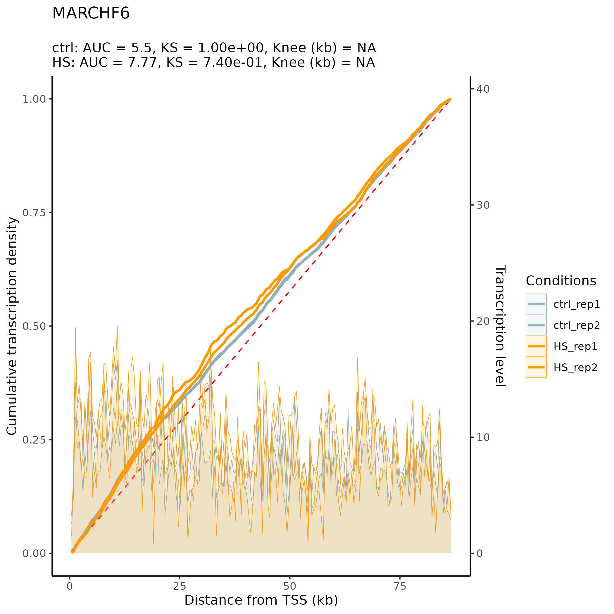
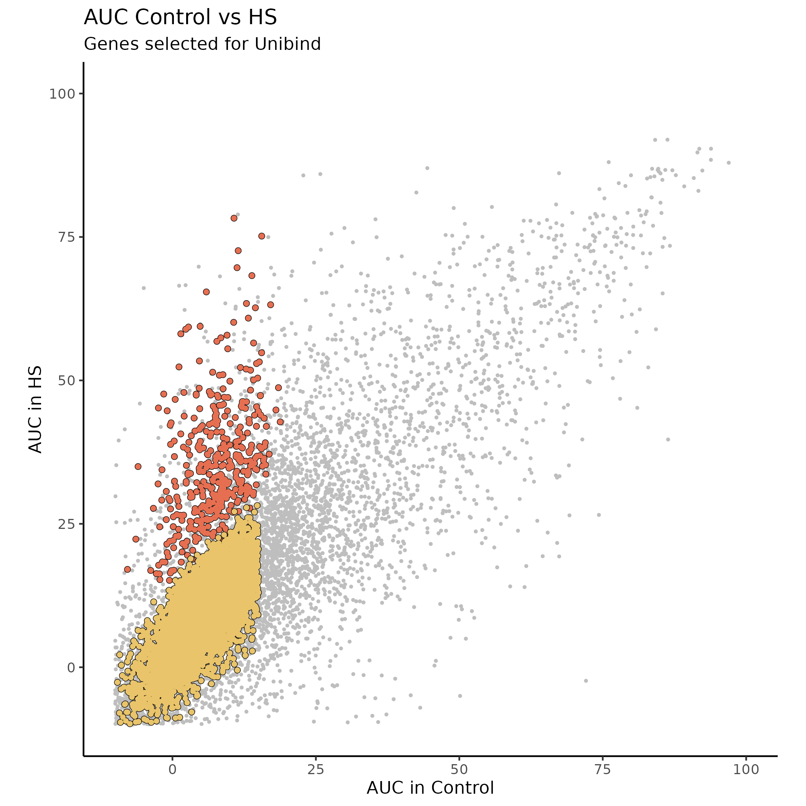
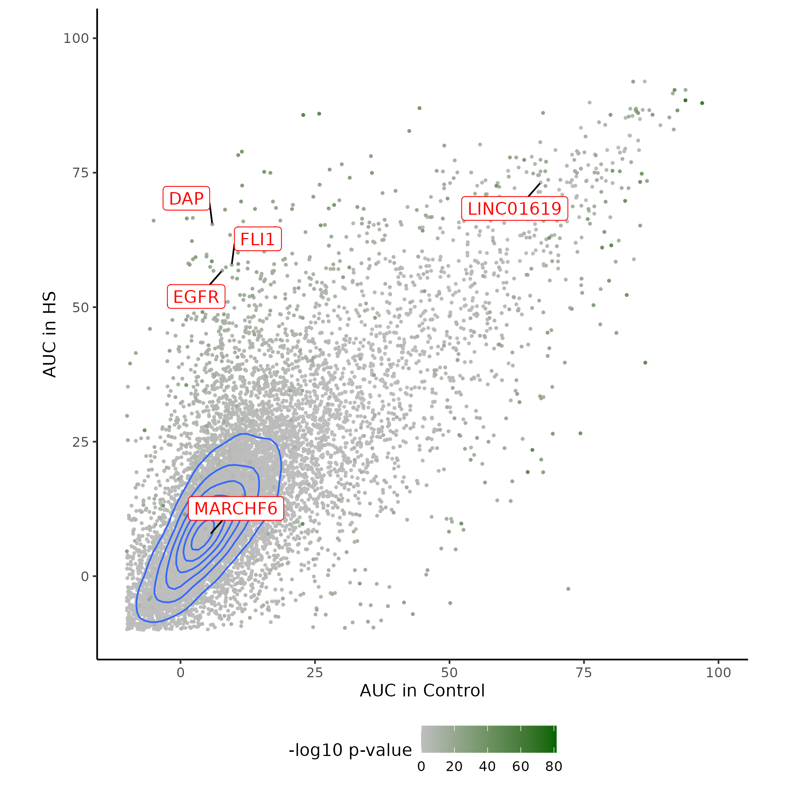

The initial files are:

```
#### The format is: victorefile (nicofiles) - note

* gencode.v43.basic.annotation.gtf (gencode.v43.basic.annotation.gtf) - downloaded from gencode website  
* hg38-blacklist.v2.sorted.bed (hg38-blacklist.v2.bed) - downloaded from https://github.com/Boyle-Lab/Blacklist/blob/master/lists/hg38-blacklist.v2.bed.gz  
* k50.umap.hg38.0.8.bed (k50.umap.hg38.0.8.bed) - sent by victor

* ctrl_rep1.forward.bg (ctrl_rep1.forward.bg) - sent by victor
* ctrl_rep1.reverse.bg (ctrl_rep1.reverse.bg) - sent by victor
* ctrl_rep2.forward.bg (ctrl_rep2.forward.bg) - sent by victor
* ctrl_rep2.reverse.bg (ctrl_rep2.reverse.bg) - sent by victor
* HS_rep1.forward.bg (HS_rep1.forward.bg) - sent by victor
* HS_rep1.reverse.bg (HS_rep1.reverse.bg) - sent by victor
* HS_rep2.forward.bg (HS_rep2.forward.bg) - sent by victor
* HS_rep2.reverse.bg (HS_rep2.reverse.bg) - sent by victor
```


The first piece of code was executed from `testfromscratch/` in which the annotation file `gencode.v43.basic.annotation.gtf` was copied. The folder hence contains only one file at this point. Retrieving the code from `BashAndR\pre-study\documentation\TSV_creation_lite_20240617.html`, and replacing `*gtf` by `gencode.v43.basic.annotation.gtf` (otherwise it generates an infinite loop), the first piece of code executed is:

```
#!/usr/bin/sh

grep -w transcript gencode.v43.basic.annotation.gtf | grep -w MANE_Select > MANE_Select.protein_coding.gtf

awk 'OFS="\t" {print $0}' MANE_Select.protein_coding.gtf | tr -d '";' | sort -k1,1 -k2,2n  | awk -F \t -v OFS='\t' '{print $0}' | awk -v OFS="\t" '{ print $1,$4,$5,$12,$16,$7}' > MANE_Select.protein_coding.bed
```

Using the same file, retrieving the transcripts:

```
#!/usr/bin/sh

grep -w transcript gencode.v43.basic.annotation.gtf | grep -w lncRNA | grep -w Ensembl_canonical | grep -v not_best_in_genome_evidence | grep -v 'transcript_support_level "5"' | grep -v 'transcript_support_level "4"' > Ensembl_canonical_TSL123.lncRNA.gtf

awk 'OFS="\t" {print $0}' Ensembl_canonical_TSL123.lncRNA.gtf | tr -d '";' | sort -k1,1 -k2,2n  | awk -F \t -v OFS='\t' '{print $0}' | awk -v OFS="\t" '{ print $1,$4,$5,$12,$16,$7}' > Ensembl_canonical_TSL123.lncRNA.bed
```

The files produced have the following number of lines:

```
> wc -l gencode.v43.basic.annotation.gtf MANE_Select.protein_coding.gtf MANE_Select.protein_coding.bed Ensembl_canonical_TSL123.lncRNA.gtf Ensembl_canonical_TSL123.lncRNA.bed

1998585 gencode.v43.basic.annotation.gtf
19077 MANE_Select.protein_coding.gtf
19077 MANE_Select.protein_coding.bed
14271 Ensembl_canonical_TSL123.lncRNA.gtf
14271 Ensembl_canonical_TSL123.lncRNA.bed
```

In the code below, note that the file of Victor is called `hg38-blacklist.v2.sorted.bed` and that therefore an extra step of sorting might have been performed. The awk command throws a warning `WARNING: Interval chrX:135309480-135309659 is smaller than the number of windows requested. Skipping.`. The echo command returns `./makewindow/v43.MANE_protein.window200.bed`. Removing the black list and make windows from the protein coding file:

```
#!/usr/bin/sh

ANNOTATION="MANE_Select.protein_coding.bed"
WORKING="."
blacklist="hg38-blacklist.v2.bed"
window=200

mkdir makewindow
awk -F "\t" -v OFS="\t" '{print $1,$2,$3,$4"_"$5"_"$6}' $ANNOTATION | bedtools intersect -a stdin -b $blacklist -v  | bedtools makewindows -n $window -i srcwinnum -b stdin | sort -k1,1 -k2,2n > $WORKING/makewindow/v43.MANE_protein.window${window}.bed  

echo $WORKING/makewindow/v43.MANE_protein.window${window}.bed 
```

Performing the same thing for lncRNA. The echo command returns `./makewindow/v43.Ensembl_canonical_TSL123.lncRNA.bed`:

```
#!/usr/bin/sh

ANNOTATION="Ensembl_canonical_TSL123.lncRNA.bed"
WORKING="."
blacklist="hg38-blacklist.v2.bed"
window=200

awk -F "\t" -v OFS="\t" '{print $1,$2,$3,$4"_"$5"_"$6}' $ANNOTATION | bedtools intersect -a stdin -b $blacklist -v  | bedtools makewindows -n $window -i srcwinnum -b stdin | sort -k1,1 -k2,2n > $WORKING/makewindow/v43.Ensembl_canonical_TSL123.lncRNA.bed 

echo $WORKING/makewindow/v43.Ensembl_canonical_TSL123.lncRNA.bed
```

Note that the awk command above gives the following warnings:

```
WARNING: Interval chr1:111181374-111181491 is smaller than the number of windows requested. Skipping.
WARNING: Interval chr1:16905199-16905396 is smaller than the number of windows requested. Skipping.
WARNING: Interval chr1:17439186-17439328 is smaller than the number of windows requested. Skipping.
WARNING: Interval chr1:222742640-222742729 is smaller than the number of windows requested. Skipping.
WARNING: Interval chr1:247189576-247189725 is smaller than the number of windows requested. Skipping.
WARNING: Interval chr1:27773858-27774041 is smaller than the number of windows requested. Skipping.
WARNING: Interval chr1:28648600-28648730 is smaller than the number of windows requested. Skipping.
WARNING: Interval chr10:13099855-13099968 is smaller than the number of windows requested. Skipping.
WARNING: Interval chr10:133374736-133374869 is smaller than the number of windows requested. Skipping.
WARNING: Interval chr11:123741776-123741896 is smaller than the number of windows requested. Skipping.
WARNING: Interval chr11:65492897-65493058 is smaller than the number of windows requested. Skipping.
WARNING: Interval chr11:94650324-94650442 is smaller than the number of windows requested. Skipping.
WARNING: Interval chr12:121874193-121874337 is smaller than the number of windows requested. Skipping.
WARNING: Interval chr12:4275562-4275755 is smaller than the number of windows requested. Skipping.
WARNING: Interval chr13:113165002-113165183 is smaller than the number of windows requested. Skipping.
WARNING: Interval chr15:40874433-40874595 is smaller than the number of windows requested. Skipping.
WARNING: Interval chr15:58456188-58456348 is smaller than the number of windows requested. Skipping.
WARNING: Interval chr16:173502-173660 is smaller than the number of windows requested. Skipping.
WARNING: Interval chr16:177313-177490 is smaller than the number of windows requested. Skipping.
WARNING: Interval chr16:29709156-29709328 is smaller than the number of windows requested. Skipping.
WARNING: Interval chr16:73014319-73014476 is smaller than the number of windows requested. Skipping.
WARNING: Interval chr17:19868568-19868689 is smaller than the number of windows requested. Skipping.
WARNING: Interval chr17:2748078-2748182 is smaller than the number of windows requested. Skipping.
WARNING: Interval chr17:30117079-30117172 is smaller than the number of windows requested. Skipping.
WARNING: Interval chr17:41867581-41867736 is smaller than the number of windows requested. Skipping.
WARNING: Interval chr17:57955965-57956143 is smaller than the number of windows requested. Skipping.
WARNING: Interval chr17:58659125-58659306 is smaller than the number of windows requested. Skipping.
WARNING: Interval chr17:80149627-80149798 is smaller than the number of windows requested. Skipping.
WARNING: Interval chr18:8406761-8406953 is smaller than the number of windows requested. Skipping.
WARNING: Interval chr2:25362232-25362427 is smaller than the number of windows requested. Skipping.
WARNING: Interval chr2:61854376-61854552 is smaller than the number of windows requested. Skipping.
WARNING: Interval chr2:64275361-64275503 is smaller than the number of windows requested. Skipping.
WARNING: Interval chr2:85387074-85387146 is smaller than the number of windows requested. Skipping.
WARNING: Interval chr20:38961925-38962111 is smaller than the number of windows requested. Skipping.
WARNING: Interval chr22:38736610-38736792 is smaller than the number of windows requested. Skipping.
WARNING: Interval chr3:179584271-179584410 is smaller than the number of windows requested. Skipping.
WARNING: Interval chr3:194637505-194637664 is smaller than the number of windows requested. Skipping.
WARNING: Interval chr3:58329965-58330118 is smaller than the number of windows requested. Skipping.
WARNING: Interval chr4:158841813-158841980 is smaller than the number of windows requested. Skipping.
WARNING: Interval chr4:68376551-68376665 is smaller than the number of windows requested. Skipping.
WARNING: Interval chr5:139775305-139775472 is smaller than the number of windows requested. Skipping.
WARNING: Interval chr6:156780327-156780455 is smaller than the number of windows requested. Skipping.
WARNING: Interval chr6:26474337-26474441 is smaller than the number of windows requested. Skipping.
WARNING: Interval chr6:28335662-28335828 is smaller than the number of windows requested. Skipping.
WARNING: Interval chr6:35764401-35764503 is smaller than the number of windows requested. Skipping.
WARNING: Interval chr6:41764292-41764460 is smaller than the number of windows requested. Skipping.
WARNING: Interval chr6:41791410-41791477 is smaller than the number of windows requested. Skipping.
WARNING: Interval chr6:43770429-43770616 is smaller than the number of windows requested. Skipping.
WARNING: Interval chr6:81969453-81969539 is smaller than the number of windows requested. Skipping.
WARNING: Interval chr7:148941483-148941638 is smaller than the number of windows requested. Skipping.
WARNING: Interval chr7:16471184-16471373 is smaller than the number of windows requested. Skipping.
WARNING: Interval chr7:25855322-25855483 is smaller than the number of windows requested. Skipping.
WARNING: Interval chr9:10948372-10948481 is smaller than the number of windows requested. Skipping.
WARNING: Interval chr9:129328261-129328401 is smaller than the number of windows requested. Skipping.
WARNING: Interval chr9:4850299-4850373 is smaller than the number of windows requested. Skipping.
WARNING: Interval chr9:97214834-97214929 is smaller than the number of windows requested. Skipping.
```

The produced files have the follwing number of lines

```
> wc -l makewindow/v43.MANE_protein.window200.bed makewindow/v43.Ensembl_canonical_TSL123.lncRNA.bed
3725600 makewindow/v43.MANE_protein.window200.bed
2772000 makewindow/v43.Ensembl_canonical_TSL123.lncRNA.bed
```

Now considering the following bedgraph files that were copied to the folder `./bedgraph255`, numbers of lines are indicated below:

```
14857004 ctrl_rep1.forward.bg
14095382 ctrl_rep1.reverse.bg
17346714 ctrl_rep2.forward.bg
16515469 ctrl_rep2.reverse.bg
11037780 HS_rep1.forward.bg
10605325 HS_rep1.reverse.bg
16466636 HS_rep2.forward.bg
15766282 HS_rep2.reverse.bg
```

The following code that was copied in a file `scoring.zsh` and is dealing with protein coding genes:

```
#!/usr/bin/zsh

## DO NOT FORGET TO CHANGE THE EXTENSION OF THE BEDGRAPH IF NEEDED
ext="bg"
##it works and validated by looking at head and tail of documents and exemple genes
WORKING="./bedgraph255"
window=200
######
umapk50="k50.umap.hg38.0.8.bed" # hg38 mappability windows with mapp k50 > 80%
windowS="makewindow/v43.MANE_protein.window${window}.bed" #genes with the window
blacklist="hg38-blacklist.v2.bed"
ANNOTATION="MANE_Select.protein_coding.bed"
#######

mkdir $WORKING/withzeros
mkdir $WORKING/mapHigh

for file in $WORKING/*.$ext ;
do
filename=$(basename "$file" .$ext);
echo "starting file :"
echo $filename;


if echo $filename | egrep -q "reverse|minus" ;  then  
  strand="-"
elif echo $filename | egrep -q "forward|plus" ; then
  strand='+'
fi

echo "removing blacklist region"
 bedtools intersect \
-a $WORKING/${filename}.$ext \
-b <( awk -F "\t" -v OFS="\t" -v myvar=$strand '{if ($6==myvar) print $1,$2,$3,$4"_"$5"_"$6}' $ANNOTATION | bedtools intersect -a stdin -b $blacklist -v) \
 | sort -k1,1 -k2,2n > $WORKING/withzeros/${filename}.nonzeros.$ext


echo "removing low mappability region"


bedtools intersect -a $WORKING/withzeros/${filename}.nonzeros.${ext} -b $umapk50 -sorted | awk -F "\t" -v OFS="\t" '{print $1,$2,$3,".",$4}' > $WORKING/mapHigh/${filename}.0.8.$ext

echo "scoring windows"

bedmap --echo --wmean --delim "\t" $windowS $WORKING/mapHigh/${filename}.0.8.$ext | awk -F "_" -v OFS="\t" '{print $1,$2,$3,$4}' | awk -F "\t" -v OFS="\t" -v name="$filename" '{ print $0,$4"_"$5"_"$6"_"$7,name}' | awk -F "\t" -v OFS="\t" '{ print "protein-coding",$1,$2,$3,$4,$5,$6,$7,$9,$10,$8 }' > $WORKING/${filename}.window${window}.MANE.wmean.name.score ;

echo "done"

done

mkdir $WORKING/protein_coding_score
mv $WORKING/*.score $WORKING/protein_coding_score/
mv $WORKING/withzeros $WORKING/withzeros-proteincoding
mv $WORKING/mapHigh $WORKING/mapHigh-proteincoding
```

The code above was executed with the command:

```
#!/usr/bin/sh

zsh scoring.zsh
```

The command gave the output:

```
starting file :
ctrl_rep1.forward
removing blacklist region
***** WARNING: File ./bedgraph255/ctrl_rep1.forward.bg has inconsistent naming convention for record:
GL000008.2      0       80      1.0061

***** WARNING: File ./bedgraph255/ctrl_rep1.forward.bg has inconsistent naming convention for record:
GL000008.2      0       80      1.0061

removing low mappability region
scoring windows
done
starting file :
ctrl_rep1.reverse
removing blacklist region
***** WARNING: File ./bedgraph255/ctrl_rep1.reverse.bg has inconsistent naming convention for record:
GL000008.2      0       580     0

***** WARNING: File ./bedgraph255/ctrl_rep1.reverse.bg has inconsistent naming convention for record:
GL000008.2      0       580     0

removing low mappability region
scoring windows
done
starting file :
ctrl_rep2.forward
removing blacklist region
***** WARNING: File ./bedgraph255/ctrl_rep2.forward.bg has inconsistent naming convention for record:
GL000008.2      0       470     0

***** WARNING: File ./bedgraph255/ctrl_rep2.forward.bg has inconsistent naming convention for record:
GL000008.2      0       470     0

removing low mappability region
scoring windows
done
starting file :
ctrl_rep2.reverse
removing blacklist region
***** WARNING: File ./bedgraph255/ctrl_rep2.reverse.bg has inconsistent naming convention for record:
GL000008.2      0       610     0

***** WARNING: File ./bedgraph255/ctrl_rep2.reverse.bg has inconsistent naming convention for record:
GL000008.2      0       610     0

removing low mappability region
scoring windows
done
starting file :
HS_rep1.forward
removing blacklist region
***** WARNING: File ./bedgraph255/HS_rep1.forward.bg has inconsistent naming convention for record:
GL000008.2      0       760     0

***** WARNING: File ./bedgraph255/HS_rep1.forward.bg has inconsistent naming convention for record:
GL000008.2      0       760     0

removing low mappability region
scoring windows
done
starting file :
HS_rep1.reverse
removing blacklist region
***** WARNING: File ./bedgraph255/HS_rep1.reverse.bg has inconsistent naming convention for record:
GL000008.2      0       2290    0

***** WARNING: File ./bedgraph255/HS_rep1.reverse.bg has inconsistent naming convention for record:
GL000008.2      0       2290    0

removing low mappability region
scoring windows
done
starting file :
HS_rep2.forward
removing blacklist region
***** WARNING: File ./bedgraph255/HS_rep2.forward.bg has inconsistent naming convention for record:
GL000008.2      0       840     0

***** WARNING: File ./bedgraph255/HS_rep2.forward.bg has inconsistent naming convention for record:
GL000008.2      0       840     0

removing low mappability region
scoring windows
done
starting file :
HS_rep2.reverse
removing blacklist region
***** WARNING: File ./bedgraph255/HS_rep2.reverse.bg has inconsistent naming convention for record:
GL000008.2      0       40      0

***** WARNING: File ./bedgraph255/HS_rep2.reverse.bg has inconsistent naming convention for record:
GL000008.2      0       40      0

removing low mappability region
scoring windows
done
```

The files produced have the following numbers of lines:

```
> wc -l bedgraph255/withzeros-proteincoding/*
  11833015 bedgraph255/withzeros-proteincoding/ctrl_rep1.forward.nonzeros.bg
  11028069 bedgraph255/withzeros-proteincoding/ctrl_rep1.reverse.nonzeros.bg
  13764078 bedgraph255/withzeros-proteincoding/ctrl_rep2.forward.nonzeros.bg
  12867337 bedgraph255/withzeros-proteincoding/ctrl_rep2.reverse.nonzeros.bg
   8299043 bedgraph255/withzeros-proteincoding/HS_rep1.forward.nonzeros.bg
   7801098 bedgraph255/withzeros-proteincoding/HS_rep1.reverse.nonzeros.bg
  12597790 bedgraph255/withzeros-proteincoding/HS_rep2.forward.nonzeros.bg
  11807275 bedgraph255/withzeros-proteincoding/HS_rep2.reverse.nonzeros.bg

> wc -l bedgraph255/mapHigh-proteincoding/*
  20651207 bedgraph255/mapHigh-proteincoding/ctrl_rep1.forward.0.8.bg
  19098231 bedgraph255/mapHigh-proteincoding/ctrl_rep1.reverse.0.8.bg
  22434617 bedgraph255/mapHigh-proteincoding/ctrl_rep2.forward.0.8.bg
  20800178 bedgraph255/mapHigh-proteincoding/ctrl_rep2.reverse.0.8.bg
  17325729 bedgraph255/mapHigh-proteincoding/HS_rep1.forward.0.8.bg
  16056740 bedgraph255/mapHigh-proteincoding/HS_rep1.reverse.0.8.bg
  21345438 bedgraph255/mapHigh-proteincoding/HS_rep2.forward.0.8.bg
  19808651 bedgraph255/mapHigh-proteincoding/HS_rep2.reverse.0.8.bg

> wc -l bedgraph255/protein_coding_score/*
   3725600 bedgraph255/protein_coding_score/ctrl_rep1.forward.window200.MANE.wmean.name.score
   3725600 bedgraph255/protein_coding_score/ctrl_rep1.reverse.window200.MANE.wmean.name.score
   3725600 bedgraph255/protein_coding_score/ctrl_rep2.forward.window200.MANE.wmean.name.score
   3725600 bedgraph255/protein_coding_score/ctrl_rep2.reverse.window200.MANE.wmean.name.score
   3725600 bedgraph255/protein_coding_score/HS_rep1.forward.window200.MANE.wmean.name.score
   3725600 bedgraph255/protein_coding_score/HS_rep1.reverse.window200.MANE.wmean.name.score
   3725600 bedgraph255/protein_coding_score/HS_rep2.forward.window200.MANE.wmean.name.score
   3725600 bedgraph255/protein_coding_score/HS_rep2.reverse.window200.MANE.wmean.name.score
```

The following code that was copied in a file `lncRNA.zsh` and is dealing with lncRNAs:

```
#!/usr/bin/zsh

ext="bg"
WORKING="bedgraph255"
window=200

umapk50="k50.umap.hg38.0.8.bed"
windowS="makewindow/v43.Ensembl_canonical_TSL123.lncRNA.bed"
blacklist="hg38-blacklist.v2.bed"
ANNOTATION="Ensembl_canonical_TSL123.lncRNA.bed"

mkdir $WORKING/withzeros
mkdir $WORKING/mapHigh

for file in $WORKING/*.$ext ;
do
filename=$(basename "$file" .$ext) ;
echo "starting file :"
echo $filename ;

if echo $filename | egrep -q "reverse|minus" ;  then 
  strand="-"
elif echo $filename | egrep -q "forward|plus" ; then
  strand='+'
fi


echo "removing blacklist region"
 bedtools intersect \
-a $WORKING/${filename}.$ext \
-b <( awk -F "\t" -v OFS="\t" -v myvar=$strand '{if ($6==myvar) print $1,$2,$3,$4"_"$5"_"$6}' $ANNOTATION | bedtools intersect -a stdin -b $blacklist -v) \
 | sort -k1,1 -k2,2n > $WORKING/withzeros/${filename}.nonzeros.$ext


echo "removing low mappability region"

bedtools intersect -a $WORKING/withzeros/${filename}.nonzeros.$ext -b $umapk50 -sorted | awk -F "\t" -v OFS="\t" '{print $1,$2,$3,".",$4}' > $WORKING/mapHigh/${filename}.0.8.$ext

echo "scoring windows"

bedmap --echo --wmean --delim "\t" $windowS $WORKING/mapHigh/${filename}.0.8.$ext | awk -F "_" -v OFS="\t" '{print $1,$2,$3,$4}' | awk -F "\t" -v OFS="\t" -v name="$filename" '{ print $0,$4"_"$5"_"$6"_"$7,name}' | awk -F "\t" -v OFS="\t" '{ print "lncRNA",$1,$2,$3,$4,$5,$6,$7,$9,$10,$8 }' > $WORKING/${filename}.window${window}.MANE.wmean.name.score ;

echo "done"

done

mkdir $WORKING/lncRNA_score
mv $WORKING/*.score $WORKING/lncRNA_score/
mv $WORKING/withzeros $WORKING/withzeros-lncRNA
mv $WORKING/mapHigh $WORKING/mapHigh-lncRNA
```

The code above was executed with the command:

```
#!/usr/bin/sh

zsh lncRNA.zsh
```

The command gave the output:

```
starting file :
ctrl_rep1.forward
removing blacklist region
***** WARNING: File bedgraph255/ctrl_rep1.forward.bg has inconsistent naming convention for record:
GL000008.2      0       80      1.0061

***** WARNING: File bedgraph255/ctrl_rep1.forward.bg has inconsistent naming convention for record:
GL000008.2      0       80      1.0061

removing low mappability region
scoring windows
done
starting file :
ctrl_rep1.reverse
removing blacklist region
***** WARNING: File bedgraph255/ctrl_rep1.reverse.bg has inconsistent naming convention for record:
GL000008.2      0       580     0

***** WARNING: File bedgraph255/ctrl_rep1.reverse.bg has inconsistent naming convention for record:
GL000008.2      0       580     0

removing low mappability region
scoring windows
done
starting file :
ctrl_rep2.forward
removing blacklist region
***** WARNING: File bedgraph255/ctrl_rep2.forward.bg has inconsistent naming convention for record:
GL000008.2      0       470     0

***** WARNING: File bedgraph255/ctrl_rep2.forward.bg has inconsistent naming convention for record:
GL000008.2      0       470     0

removing low mappability region
scoring windows
done
starting file :
ctrl_rep2.reverse
removing blacklist region
***** WARNING: File bedgraph255/ctrl_rep2.reverse.bg has inconsistent naming convention for record:
GL000008.2      0       610     0

***** WARNING: File bedgraph255/ctrl_rep2.reverse.bg has inconsistent naming convention for record:
GL000008.2      0       610     0

removing low mappability region
scoring windows
done
starting file :
HS_rep1.forward
removing blacklist region
***** WARNING: File bedgraph255/HS_rep1.forward.bg has inconsistent naming convention for record:
GL000008.2      0       760     0

***** WARNING: File bedgraph255/HS_rep1.forward.bg has inconsistent naming convention for record:
GL000008.2      0       760     0

removing low mappability region
scoring windows
done
starting file :
HS_rep1.reverse
removing blacklist region
***** WARNING: File bedgraph255/HS_rep1.reverse.bg has inconsistent naming convention for record:
GL000008.2      0       2290    0

***** WARNING: File bedgraph255/HS_rep1.reverse.bg has inconsistent naming convention for record:
GL000008.2      0       2290    0

removing low mappability region
scoring windows
done
starting file :
HS_rep2.forward
removing blacklist region
***** WARNING: File bedgraph255/HS_rep2.forward.bg has inconsistent naming convention for record:
GL000008.2      0       840     0

***** WARNING: File bedgraph255/HS_rep2.forward.bg has inconsistent naming convention for record:
GL000008.2      0       840     0

removing low mappability region
scoring windows
done
starting file :
HS_rep2.reverse
removing blacklist region
***** WARNING: File bedgraph255/HS_rep2.reverse.bg has inconsistent naming convention for record:
GL000008.2      0       40      0

***** WARNING: File bedgraph255/HS_rep2.reverse.bg has inconsistent naming convention for record:
GL000008.2      0       40      0

removing low mappability region
scoring windows
done
```

The files produced have the following numbers of lines:

```
> wc -l bedgraph255/withzeros-lncRNA/*
   426766 bedgraph255/withzeros-lncRNA/ctrl_rep1.forward.nonzeros.bg
   431670 bedgraph255/withzeros-lncRNA/ctrl_rep1.reverse.nonzeros.bg
   495350 bedgraph255/withzeros-lncRNA/ctrl_rep2.forward.nonzeros.bg
   514695 bedgraph255/withzeros-lncRNA/ctrl_rep2.reverse.nonzeros.bg
   353893 bedgraph255/withzeros-lncRNA/HS_rep1.forward.nonzeros.bg
   358254 bedgraph255/withzeros-lncRNA/HS_rep1.reverse.nonzeros.bg
   483067 bedgraph255/withzeros-lncRNA/HS_rep2.forward.nonzeros.bg
   497714 bedgraph255/withzeros-lncRNA/HS_rep2.reverse.nonzeros.bg

> wc -l bedgraph255/mapHigh-lncRNA/*
  3716631 bedgraph255/mapHigh-lncRNA/ctrl_rep1.forward.0.8.bg
  3421650 bedgraph255/mapHigh-lncRNA/ctrl_rep1.reverse.0.8.bg
  3777258 bedgraph255/mapHigh-lncRNA/ctrl_rep2.forward.0.8.bg
  3494694 bedgraph255/mapHigh-lncRNA/ctrl_rep2.reverse.0.8.bg
  3649638 bedgraph255/mapHigh-lncRNA/HS_rep1.forward.0.8.bg
  3355952 bedgraph255/mapHigh-lncRNA/HS_rep1.reverse.0.8.bg
  3763918 bedgraph255/mapHigh-lncRNA/HS_rep2.forward.0.8.bg
  3477181 bedgraph255/mapHigh-lncRNA/HS_rep2.reverse.0.8.bg

> wc -l bedgraph255/lncRNA_score/*
   2772000 bedgraph255/lncRNA_score/ctrl_rep1.forward.window200.MANE.wmean.name.score
   2772000 bedgraph255/lncRNA_score/ctrl_rep1.reverse.window200.MANE.wmean.name.score
   2772000 bedgraph255/lncRNA_score/ctrl_rep2.forward.window200.MANE.wmean.name.score
   2772000 bedgraph255/lncRNA_score/ctrl_rep2.reverse.window200.MANE.wmean.name.score
   2772000 bedgraph255/lncRNA_score/HS_rep1.forward.window200.MANE.wmean.name.score
   2772000 bedgraph255/lncRNA_score/HS_rep1.reverse.window200.MANE.wmean.name.score
   2772000 bedgraph255/lncRNA_score/HS_rep2.forward.window200.MANE.wmean.name.score
   2772000 bedgraph255/lncRNA_score/HS_rep2.reverse.window200.MANE.wmean.name.score
```

Executing the following R code to combine the files for protein coding:

```
main_directory <- "bedgraph255"
write_file_protein_coding <- paste0(main_directory,"/protCoding_dTAG_Cugusi_stranded_20230810.tsv")
write_file_lncRNA <- paste0(main_directory,"/lncRNA_dTAG_Cugusi_stranded_20230810.tsv")
Big_tsv <-paste0(main_directory,"/dTAG_Cugusi_stranded_20230810.tsv") 

library(dplyr)
library(purrr)

### DO NOT FORGET TO CHANGE THE BEDGRAPH EXTENSION TO TH ONE IN USE IN THE FOLDER
window <- 200
working_directory <- paste0(main_directory,"/protein_coding_score")
bedgraph_files <- list.files(main_directory, pattern = "*.bg", full.names = TRUE)

files <- bedgraph_files %>%
  map(~{
    filename <- tools::file_path_sans_ext(basename(.))
    file.path(working_directory, paste0(filename, ".window", window, ".MANE.wmean.name.score"))
  })

# reading all the files
list_of_dfs <- lapply(files, read.delim, header= F, sep= "\t",  na.strings = "NAN", dec = ".", col.names = c("biotype","chr", "coor1", "coor2","transcript", "gene", "strand","window","id","dataset","score"), stringsAsFactors=FALSE)

# joining all the files
joined_df <- purrr::reduce(list_of_dfs, dplyr::left_join, by = c("biotype","chr","coor1","coor2","transcript","gene","strand","window","id")) %>% 
   dplyr::filter(strand!="Y") ## the last filter remove the PAR genes (pseudoautosomal genes both in X and Y)

 write.table(joined_df, file = write_file_protein_coding, sep = "\t", row.names = FALSE, col.names = FALSE, quote = F)

 rm(list_of_dfs)
 rm(joined_df)
```

The code above was copied to the file `joinprotcod.R` and executed with R-4.4.1:

```
Rscript joinprotcod.R
```

The following file was obtained:

```
> wc -l bedgraph255/protCoding_dTAG_Cugusi_stranded_20230810.tsv
3722600 bedgraph255/protCoding_dTAG_Cugusi_stranded_20230810.tsv
```

Executing the following R code to combine the files for lncRNA:

```
library(dplyr)
library(purrr)

### DO NOT FORGET TO CHANGE THE BEDGRAPH EXTENSION TO TH ONE IN USE IN THE FOLDER
window <- 200
main_directory <- "bedgraph255"
working_directory <- paste0(main_directory,"/lncRNA_score")
write_file_lncRNA <- paste0(main_directory,"/lncRNA_dTAG_Cugusi_stranded_20230810.tsv")

bedgraph_files <- list.files(main_directory, pattern = "*.bg", full.names = TRUE)

files <- bedgraph_files %>%
  map(~{
    filename <- tools::file_path_sans_ext(basename(.))
    file.path(working_directory, paste0(filename, ".window", window, ".MANE.wmean.name.score"))
  })
# reading all the files
list_of_dfs <- lapply(files, read.delim, header= F, sep= "\t",  na.strings = "NAN", dec = ".", col.names = c("biotype","chr", "coor1", "coor2","transcript", "gene", "strand","window","id","dataset","score"), stringsAsFactors=FALSE)
# joining all the files
joined_df <- purrr::reduce(list_of_dfs, dplyr::left_join, by = c("biotype","chr","coor1","coor2","transcript","gene","strand","window","id")) %>% 
   dplyr::filter(strand!="Y") ## the last filter remove the PAR genes (pseudoautosomal genes both in X and Y)

write.table(joined_df, file = write_file_lncRNA, sep = "\t", row.names = FALSE, col.names = FALSE, quote = F)
rm(list_of_dfs)
rm(joined_df)
```

The code above was copied to the file `joinlncrna.R` and executed with R-4.4.1:

```
Rscript joinlncrna.R
```

The following file was obtained:

```
> wc -l bedgraph255/lncRNA_dTAG_Cugusi_stranded_20230810.tsv
    2770600 bedgraph255/lncRNA_dTAG_Cugusi_stranded_20230810.tsv
```

The R code below was used to merge the tables:

```
library(dplyr)
library(purrr)

main_directory <- "bedgraph255"
Big_tsv <-paste0(main_directory,"/dTAG_Cugusi_stranded_20230810.tsv") 

tsv_files <- list.files(main_directory, pattern = "*.tsv", full.names = TRUE)

files <- tsv_files %>%
  map(~{
    filename <- tools::file_path_sans_ext(basename(.))
    file.path(main_directory, paste0(filename, ".tsv"))
  })
# reading all the files
list_of_dfs <- lapply(files, read.delim, header= F, sep= "\t",  na.strings = "NAN", dec = ".", stringsAsFactors=FALSE)
# joining all the files
bound_df <- purrr::reduce(list_of_dfs, dplyr::bind_rows)

write.table(bound_df, file = Big_tsv, sep = "\t", row.names = FALSE, col.names = FALSE, quote = F)
rm(list_of_dfs)
rm(bound_df)
```

The code was copied to `jointsvs.R` and executed with the command:

```
Rscript jointsvs.R
```

The following file was obtained:

```
> wc -l bedgraph255/dTAG_Cugusi_stranded_20230810.tsv
    6493200 bedgraph255/dTAG_Cugusi_stranded_20230810.tsv
```


Note that in the provided script, the input table has a different name: `Cugusi_protein-lncRNA_stranded_analysis_MAPQ255_20230705.tsv`. It was replaced by the one obtained above `dTAG_Cugusi_stranded_20230810.tsv` in the variable `name_table`. The following code reads and filters this file based on a minimal expression threshold:

```
#setting columns names
#files names have to be : condition_rep#.strand, a condition can contain several sub condition (cond1a_cond1b)

working_directory <- "bedgraph255" 
## in the working directory the files are: 
# ctrl_rep1.forward.bg  ctrl_rep2.forward.bg  HS_rep1.forward.bg  HS_rep2.forward.bg
# ctrl_rep1.reverse.bg  ctrl_rep2.reverse.bg  HS_rep1.reverse.bg  HS_rep2.reverse.bg
# Cugusi_protein-lncRNA_stranded_analysis_MAPQ255_20230705.tsv 

extension <- "*.bg"
name_table <- "dTAG_Cugusi_stranded_20230810.tsv"
rounding <- 10

getting_var_names <- function(extension, working_directory) {
  
# This function uses the extension and working directory to get the condition names, the number of replicates, and the variable names.
# It needs the file names to be written in the form:
# Condition_rep#.strand.extension such as :
# HS_rep1.reverse.bg
  
  
# In input: extension such as "*.bg" and the working directory
  
  
  bedgraph_files <- list.files(working_directory, pattern = extension, full.names = TRUE)
  files <- bedgraph_files %>%
    map(~{
      filename <- tools::file_path_sans_ext(basename(.))
    })
  
  string <- files
  var_names <- string
  
  for (i in seq_along(var_names)) {
    if (grepl("(reverse|forward)", var_names[i])) {
      var_names[i] <- gsub("reverse", "minus", var_names[i])
      var_names[i] <- gsub("forward", "plus", var_names[i])
    }
  }
  
  # Extract conditions
  Conditions <- unique(sub("(\\w+)_rep\\d+.*", "\\1", var_names)) ## verify it can work with several "_" 
  
  # Extract replication numbers
  replicate_numbers <- unique(sub(".*_rep(\\d+).*", "\\1", var_names))
  
  ###########
  # Setting fixed column names
  fixed_names <- c("biotype","chr", "coor1", "coor2","transcript", "gene", "strand","window","id") #biotype is added in the .tsv file
  
  num_fixed_cols <- length(fixed_names)
  # Number of variable columns based on input file
  num_var_cols <- ncol(table) - num_fixed_cols
  #Generate variable column names for category 2, alternating with category 1
  test <- rep(var_names, each=2)
  suffix <- rep(c("", "_score"), length(var_names))
  test <- paste0(test, suffix)
  col_names <- c(fixed_names, test)
  
  return(list(col_names=col_names,var_names=var_names, replicate_numbers=replicate_numbers, Conditions=Conditions)) 
}

main_table_read <- function(name_table, extension, working_directory, expression_threshold){

df_final <- data.frame()
df_final_gene <- data.frame()
concat_df <- data.frame()
gene_name_list <- character()
expressed_gene_name_list <- character()

#file
#Load data without header
res <- getting_var_names(extension, working_directory)
col_names <- res$col_names
var_names <- res$var_names

main_table <- data.frame()

main_table <- read.delim(paste0(working_directory,"/",name_table),
                      header = FALSE, # set header = FALSE to avoid overwriting it
                      sep="\t",
                      col.names = col_names )


for (gene in unique(main_table$gene)){
  gene_name_list <- c(gene_name_list, gene)
}
sorted_list <- sort(gene_name_list, decreasing = F)
#print(length(sorted_list))
#####

# Get the column names with the suffix "score"
score_columns <- grep("score$", col_names, value = TRUE)

# Initialize an empty list to store the mean column names
mean_column_names <- list()
expressed_gene_name <- data.frame()
expressed_plus <- data.frame()

expressed_transcript_name <- main_table %>%
  group_by(transcript) %>%
  dplyr::summarize(gene=gene[1],strand=strand[1],
                   across(all_of(score_columns), ~ mean(., na.rm = TRUE), .names = "{.col}_mean")
  )


expressed_plus <- expressed_transcript_name %>%
  filter(strand=="+") %>% 
  select(gene, transcript, strand, contains("plus"))  %>%
  filter(across(all_of(contains("score")), ~ !is.na(.) ) ) %>%
  filter(across(all_of(contains("score")), ~ . >expression_threshold ) )

expressed_minus <- expressed_transcript_name %>%
  filter(strand=="-") %>% 
  select(gene,transcript, strand, contains("minus")) %>%
  filter(across(all_of(contains("score")), ~ !is.na(.) ) ) %>%
  filter(across(all_of(contains("score")), ~ . >expression_threshold ) )

expressed_transcript_name_list <- bind_rows(expressed_plus, expressed_minus) %>% arrange(transcript) %>% pull(transcript)
#print(length(expressed_transcript_name_list)) ## this will set the loading bar

return(list(main_table=main_table,expressed_transcript_name_list=expressed_transcript_name_list))

}

library(tidyr)
library(purrr)
library(dplyr)

results_main_table <- main_table_read(name_table, extension, working_directory, 0.1)
saveRDS(results_main_table, file = "/g/romebioinfo/Projects/tepr/testfromscratch/results_main_table.rds")

message("The results obtained have the following features:")
print(is(results_main_table))
print(length(results_main_table))
print(is(results_main_table[[1]]))
print(is(results_main_table[[2]]))
print(dim(results_main_table[[1]]))
print(length(results_main_table[[2]]))
print(head(results_main_table[[1]]))
print(head(results_main_table[[2]]))
```

The code above was copied to `results_main_table.R` and run with:

```
Rscript results_main_table.R
```

The script should output:

```

Attaching package: ‘dplyr’

The following objects are masked from ‘package:stats’:

    filter, lag

The following objects are masked from ‘package:base’:

    intersect, setdiff, setequal, union

Warning messages:
1: Using `across()` in `filter()` was deprecated in dplyr 1.0.8.
ℹ Please use `if_any()` or `if_all()` instead.
2: Using `across()` in `filter()` was deprecated in dplyr 1.0.8.
ℹ Please use `if_any()` or `if_all()` instead.
3: Using `across()` in `filter()` was deprecated in dplyr 1.0.8.
ℹ Please use `if_any()` or `if_all()` instead.
4: Using `across()` in `filter()` was deprecated in dplyr 1.0.8.
ℹ Please use `if_any()` or `if_all()` instead.
The results obtained have the following features:
[1] "list"   "vector"
[1] 2
[1] "data.frame" "list"       "oldClass"   "vector"
[1] "character"           "vector"              "data.frameRowLabels"
[4] "SuperClassMethod"
[1] 6493200      25
[1] 15002
  biotype  chr  coor1  coor2        transcript   gene strand window
1  lncRNA chr1 817371 817383 ENST00000326734.2 FAM87B      +      1
2  lncRNA chr1 817383 817395 ENST00000326734.2 FAM87B      +      2
3  lncRNA chr1 817395 817407 ENST00000326734.2 FAM87B      +      3
4  lncRNA chr1 817407 817419 ENST00000326734.2 FAM87B      +      4
5  lncRNA chr1 817419 817431 ENST00000326734.2 FAM87B      +      5
6  lncRNA chr1 817431 817443 ENST00000326734.2 FAM87B      +      6
                            id    ctrl_rep1.plus ctrl_rep1.plus_score
1 ENST00000326734.2_FAM87B_+_1 ctrl_rep1.forward                    0
2 ENST00000326734.2_FAM87B_+_2 ctrl_rep1.forward                   NA
3 ENST00000326734.2_FAM87B_+_3 ctrl_rep1.forward                   NA
4 ENST00000326734.2_FAM87B_+_4 ctrl_rep1.forward                   NA
5 ENST00000326734.2_FAM87B_+_5 ctrl_rep1.forward                   NA
6 ENST00000326734.2_FAM87B_+_6 ctrl_rep1.forward                   NA
    ctrl_rep1.minus ctrl_rep1.minus_score    ctrl_rep2.plus
1 ctrl_rep1.reverse                    NA ctrl_rep2.forward
2 ctrl_rep1.reverse                    NA ctrl_rep2.forward
3 ctrl_rep1.reverse                    NA ctrl_rep2.forward
4 ctrl_rep1.reverse                    NA ctrl_rep2.forward
5 ctrl_rep1.reverse                    NA ctrl_rep2.forward
6 ctrl_rep1.reverse                    NA ctrl_rep2.forward
  ctrl_rep2.plus_score   ctrl_rep2.minus ctrl_rep2.minus_score    HS_rep1.plus
1                    0 ctrl_rep2.reverse                    NA HS_rep1.forward
2                   NA ctrl_rep2.reverse                    NA HS_rep1.forward
3                   NA ctrl_rep2.reverse                    NA HS_rep1.forward
4                   NA ctrl_rep2.reverse                    NA HS_rep1.forward
5                   NA ctrl_rep2.reverse                    NA HS_rep1.forward
6                   NA ctrl_rep2.reverse                    NA HS_rep1.forward
  HS_rep1.plus_score   HS_rep1.minus HS_rep1.minus_score    HS_rep2.plus
1                  0 HS_rep1.reverse                  NA HS_rep2.forward
2                 NA HS_rep1.reverse                  NA HS_rep2.forward
3                 NA HS_rep1.reverse                  NA HS_rep2.forward
4                 NA HS_rep1.reverse                  NA HS_rep2.forward
5                 NA HS_rep1.reverse                  NA HS_rep2.forward
6                 NA HS_rep1.reverse                  NA HS_rep2.forward
  HS_rep2.plus_score   HS_rep2.minus HS_rep2.minus_score
1                  0 HS_rep2.reverse                  NA
2                 NA HS_rep2.reverse                  NA
3                 NA HS_rep2.reverse                  NA
4                 NA HS_rep2.reverse                  NA
5                 NA HS_rep2.reverse                  NA
6                 NA HS_rep2.reverse                  NA
[1] "ENST00000000233.10" "ENST00000000412.8"  "ENST00000000442.11"
[4] "ENST00000001008.6"  "ENST00000001146.7"  "ENST00000002125.9"
```

The following code computes ECDF on the main table:

```
library(tidyr)
library(purrr)
library(dplyr)

working_directory <- "bedgraph255" 
## in the working directory the files are: 
# ctrl_rep1.forward.bg  ctrl_rep2.forward.bg  HS_rep1.forward.bg  HS_rep2.forward.bg
# ctrl_rep1.reverse.bg  ctrl_rep2.reverse.bg  HS_rep1.reverse.bg  HS_rep2.reverse.bg
# Cugusi_protein-lncRNA_stranded_analysis_MAPQ255_20230705.tsv 

extension <- "*.bg"
name_table <- "dTAG_Cugusi_stranded_20230810.tsv"
rounding <- 10

getting_var_names <- function(extension, working_directory) {
  
# This function uses the extension and working directory to get the condition names, the number of replicates, and the variable names.
# It needs the file names to be written in the form:
# Condition_rep#.strand.extension such as :
# HS_rep1.reverse.bg
  
  
# In input: extension such as "*.bg" and the working directory
  
  
  bedgraph_files <- list.files(working_directory, pattern = extension, full.names = TRUE)
  files <- bedgraph_files %>%
    map(~{
      filename <- tools::file_path_sans_ext(basename(.))
    })
  
  string <- files
  var_names <- string
  
  for (i in seq_along(var_names)) {
    if (grepl("(reverse|forward)", var_names[i])) {
      var_names[i] <- gsub("reverse", "minus", var_names[i])
      var_names[i] <- gsub("forward", "plus", var_names[i])
    }
  }
  
  # Extract conditions
  Conditions <- unique(sub("(\\w+)_rep\\d+.*", "\\1", var_names)) ## verify it can work with several "_" 
  
  # Extract replication numbers
  replicate_numbers <- unique(sub(".*_rep(\\d+).*", "\\1", var_names))
  
  ###########
  # Setting fixed column names
  fixed_names <- c("biotype","chr", "coor1", "coor2","transcript", "gene", "strand","window","id") #biotype is added in the .tsv file
  
  num_fixed_cols <- length(fixed_names)
  # Number of variable columns based on input file
  num_var_cols <- ncol(table) - num_fixed_cols
  #Generate variable column names for category 2, alternating with category 1
  test <- rep(var_names, each=2)
  suffix <- rep(c("", "_score"), length(var_names))
  test <- paste0(test, suffix)
  col_names <- c(fixed_names, test)
  
  return(list(col_names=col_names,var_names=var_names, replicate_numbers=replicate_numbers, Conditions=Conditions)) 
}

genesECDF <- function(main_table, rounding, expressed_transcript_name_list, extension, working_directory){
gc()
  
res <- getting_var_names(extension, working_directory)
col_names <- res$col_names
var_names <- res$var_names  
  
total_iterations <- length(expressed_transcript_name_list)
#setting the progress bar
pb <- txtProgressBar(min = 0, max = total_iterations, style =5)

j=0
concat_df <- data.frame()
## Looping through all the transcripts
for (variable in expressed_transcript_name_list){
  gene_table <- data.frame()
  bigDF <- data.frame()  
  
  transcript_table <- data.frame()
  transcript <- filter(main_table, main_table$transcript==variable) 
  transcript[transcript == "NAN"] <- NA
  bigDF <- transcript
  my_length <- length(bigDF[,'window'])
  
  
  var_names_score <- paste0(var_names,"_score")
  
  if (transcript$strand[1]=="-") {
    bigDF <- bigDF %>%
      select(!matches("plus"))
    bigDF$coord <- seq(from=my_length, to=1,by=-1)
    bigDF <- arrange(bigDF, coord)
    conditions <- var_names_score[grepl("minus",var_names_score)]
  } else {
    bigDF <- bigDF %>%
      select(!matches("minus"))
    bigDF$coord <- seq(from=1, to=my_length,by=1)
    conditions <- var_names_score[grepl("plus",var_names_score)]
  }
  
  bigDF <- bigDF %>% fill(contains("score"), .direction = "downup")
  
  df_long <- bigDF %>% 
    gather(key = "variable", value = "value", conditions)
  df_long[,'value'] <- as.numeric(df_long[,'value'])
  df_long[,'value_round']<- round(df_long$value*rounding)
  
  j=j+1
#  Update the progress bar
  setTxtProgressBar(pb, j)
  
  list_df <- list()
  i <- 1
  for (my_var in unique(df_long$variable)){
    
    df_subset <- subset(df_long, subset = variable == my_var) 
    df_expanded <- df_subset[rep(seq_len(nrow(df_subset)), df_subset$value_round), ]
    ecdf_df <- ecdf(df_expanded[,"coord"])
    df_subset$Fx <- ecdf_df(df_subset$coord) 
    list_df[[i]] <- df_subset
    i <- i + 1
  }
  
  df_final <- bind_rows(list_df)
  transcript_table <- df_final  %>% pivot_wider(., names_from = "variable", values_from = c("value", "value_round", "Fx")) %>% select(., -contains("value_round")) 
  
  # getting rid of plus and minus
  if (transcript_table$strand[1]=="-") {
    # Drop columns containing "minus"
    columns_to_drop <- grep("plus", names(col_names), value = TRUE)
    dataset_without_dropped <- transcript_table %>%
      select(-all_of(columns_to_drop))
    
    # Modify column names by removing "_plus"
    modified_dataset <- dataset_without_dropped %>%
      rename_with(~gsub(".minus", "", .), contains(".minus"))
    
  } else {
    # Drop columns containing "minus"
    columns_to_drop <- grep("minus", names(col_names), value = TRUE)
    dataset_without_dropped <- transcript_table %>%
      select(-all_of(columns_to_drop))
    
    # Modify column names by removing "_plus"
    modified_dataset <- dataset_without_dropped %>%
      rename_with(~gsub(".plus", "", .), contains(".plus"))
    
  }
  concat_df <- bind_rows(concat_df, modified_dataset)
  
}

# # Close the progress bar
 close(pb)  
# list_gene_table <- concat_df %>% select(gene) %>% distinct()
gc()

return(concat_df=concat_df)
}

results_main_table <- readRDS("/g/romebioinfo/Projects/tepr/testfromscratch/results_main_table.rds")
main_table <- results_main_table$main_table # %>% filter(gene=="DAP")
expressed_transcript_name_list <- results_main_table[[2]]
resultsECDF <- genesECDF(main_table, rounding, expressed_transcript_name_list, extension, working_directory)

PATH <- "./"
rounding <- 10
window_n <- 200
PaperYear <- "cugusi2023"

resultsECDF_path <- paste0(PATH,PaperYear,"_ECDFScores_",rounding,"_",window_n,".tsv")
write.table(resultsECDF, file = resultsECDF_path, sep = "\t", quote = FALSE, row.names = FALSE, col.names = T)

print(is(resultsECDF))
print(head(resultsECDF))
```

The code above was copied to `ecdf.R` and run with:

```
Rscript ecdf.R
```

The script should output:

```

Attaching package: ‘dplyr’

The following objects are masked from ‘package:stats’:

    filter, lag

The following objects are masked from ‘package:base’:

    intersect, setdiff, setequal, union

=============================================================================== =
Warning message:
Using an external vector in selections was deprecated in tidyselect 1.1.0.
ℹ Please use `all_of()` or `any_of()` instead.
  # Was:
  data %>% select(conditions)

  # Now:
  data %>% select(all_of(conditions))

See <https://tidyselect.r-lib.org/reference/faq-external-vector.html>.
[1] "data.frame" "list"       "oldClass"   "vector"
         biotype  chr     coor1     coor2         transcript gene strand window
1 protein-coding chr7 127588411 127588427 ENST00000000233.10 ARF5      +      1
2 protein-coding chr7 127588427 127588443 ENST00000000233.10 ARF5      +      2
3 protein-coding chr7 127588443 127588459 ENST00000000233.10 ARF5      +      3
4 protein-coding chr7 127588459 127588475 ENST00000000233.10 ARF5      +      4
5 protein-coding chr7 127588475 127588491 ENST00000000233.10 ARF5      +      5
6 protein-coding chr7 127588491 127588507 ENST00000000233.10 ARF5      +      6
                           id         ctrl_rep1         ctrl_rep2
1 ENST00000000233.10_ARF5_+_1 ctrl_rep1.forward ctrl_rep2.forward
2 ENST00000000233.10_ARF5_+_2 ctrl_rep1.forward ctrl_rep2.forward
3 ENST00000000233.10_ARF5_+_3 ctrl_rep1.forward ctrl_rep2.forward
4 ENST00000000233.10_ARF5_+_4 ctrl_rep1.forward ctrl_rep2.forward
5 ENST00000000233.10_ARF5_+_5 ctrl_rep1.forward ctrl_rep2.forward
6 ENST00000000233.10_ARF5_+_6 ctrl_rep1.forward ctrl_rep2.forward
          HS_rep1         HS_rep2 coord value_ctrl_rep1_score
1 HS_rep1.forward HS_rep2.forward     1              0.000000
2 HS_rep1.forward HS_rep2.forward     2              0.000000
3 HS_rep1.forward HS_rep2.forward     3              0.000000
4 HS_rep1.forward HS_rep2.forward     4              0.000000
5 HS_rep1.forward HS_rep2.forward     5              0.000000
6 HS_rep1.forward HS_rep2.forward     6              0.440169
  value_ctrl_rep2_score value_HS_rep1_score value_HS_rep2_score
1                     0                   0                   0
2                     0                   0                   0
3                     0                   0                   0
4                     0                   0                   0
5                     0                   0                   0
6                     0                   0                   0
  Fx_ctrl_rep1_score Fx_ctrl_rep2_score Fx_HS_rep1_score Fx_HS_rep2_score
1       0.0000000000                  0                0                0
2       0.0000000000                  0                0                0
3       0.0000000000                  0                0                0
4       0.0000000000                  0                0                0
5       0.0000000000                  0                0                0
6       0.0004959702                  0                0                0
```

The code below calculates mean values:

```
library(tidyr)
library(purrr)
library(dplyr)

working_directory <- "bedgraph255" 
extension <- "*.bg"


getting_var_names <- function(extension, working_directory) {
  
# This function uses the extension and working directory to get the condition names, the number of replicates, and the variable names.
# It needs the file names to be written in the form:
# Condition_rep#.strand.extension such as :
# HS_rep1.reverse.bg
  
  
# In input: extension such as "*.bg" and the working directory
  
  
  bedgraph_files <- list.files(working_directory, pattern = extension, full.names = TRUE)
  files <- bedgraph_files %>%
    map(~{
      filename <- tools::file_path_sans_ext(basename(.))
    })
  
  string <- files
  var_names <- string
  
  for (i in seq_along(var_names)) {
    if (grepl("(reverse|forward)", var_names[i])) {
      var_names[i] <- gsub("reverse", "minus", var_names[i])
      var_names[i] <- gsub("forward", "plus", var_names[i])
    }
  }
  
  # Extract conditions
  Conditions <- unique(sub("(\\w+)_rep\\d+.*", "\\1", var_names)) ## verify it can work with several "_" 
  
  # Extract replication numbers
  replicate_numbers <- unique(sub(".*_rep(\\d+).*", "\\1", var_names))
  
  ###########
  # Setting fixed column names
  fixed_names <- c("biotype","chr", "coor1", "coor2","transcript", "gene", "strand","window","id") #biotype is added in the .tsv file
  
  num_fixed_cols <- length(fixed_names)
  # Number of variable columns based on input file
  num_var_cols <- ncol(table) - num_fixed_cols
  #Generate variable column names for category 2, alternating with category 1
  test <- rep(var_names, each=2)
  suffix <- rep(c("", "_score"), length(var_names))
  test <- paste0(test, suffix)
  col_names <- c(fixed_names, test)
  
  return(list(col_names=col_names,var_names=var_names, replicate_numbers=replicate_numbers, Conditions=Conditions)) 
}

calculates_meanFx <- function(concat_df,window_number){

res <- getting_var_names(extension, working_directory)
Conditions <- res$Conditions
replicate_numbers <- res$replicate_numbers


column_vector_value <- character()
column_vector_Fx <- character()


for (cond in Conditions) {
  mean_value_condi_name <- paste0("mean_value_", cond)
  mean_Fx_condi_name <- paste0("mean_Fx_", cond)
  diff_Fx_condi_name <- paste0("diff_Fx_", cond)
  
  for (rep_num in replicate_numbers) {
    new_column_value <- paste0("value_", cond, "_rep", rep_num, "_score") # Generate a new item
    new_column_Fx <- paste0("Fx_", cond, "_rep", rep_num, "_score") # Generate a new item
    column_vector_value <- c(column_vector_value, new_column_value)
    column_vector_Fx <- c(column_vector_Fx, new_column_Fx)
  }
  # Calculate row means for the specified columns
  # Check if there is more than one replicate
  if (length(replicate_numbers) > 1) {
    concat_df[[mean_value_condi_name]] <- rowMeans(concat_df[, column_vector_value], na.rm = F)
    concat_df[[mean_Fx_condi_name]] <- rowMeans(concat_df[, column_vector_Fx], na.rm = FALSE)
  } else {
    # Handle case when column_vector_value is empty
    new_column_value <- paste0("value_", cond, "_rep", "1", "_score") # Generate a new item
    new_column_Fx <- paste0("Fx_", cond, "_rep", "1", "_score") # Generate a new item
    
    concat_df[[mean_value_condi_name]] <- concat_df[[new_column_value]]
    concat_df[[mean_Fx_condi_name]] <- concat_df[[new_column_Fx]]
  }
  
  concat_df[[diff_Fx_condi_name]] <- concat_df[[mean_Fx_condi_name]] - concat_df$coord/window_number ## Difference with the y=x ECDF, used to calculate AUC
  
  column_vector_value <- character() ## obligatory to reset the columns values to empty
  column_vector_Fx <- character()
}

return(concat_dfFx=concat_df)
}

PATH <- "./"
rounding <- 10
window_n <- 200
PaperYear <- "cugusi2023"
resultsECDF_path <- paste0(PATH,PaperYear,"_ECDFScores_",rounding,"_",window_n,".tsv")
resultsECDF <- read.delim(resultsECDF_path, header = TRUE)
concat_dfFX_res <- calculates_meanFx(resultsECDF, 200)
saveRDS(concat_dfFX_res, file = "concat_dfFX_res.rds")
print(head(concat_dfFX_res))
```

The code was copied to `concat_dfFX_res.R` and run with:

```
Rscript concat_dfFX_res.R
```

The script should output:

```
         biotype  chr     coor1     coor2         transcript gene strand window
1 protein-coding chr7 127588411 127588427 ENST00000000233.10 ARF5      +      1
2 protein-coding chr7 127588427 127588443 ENST00000000233.10 ARF5      +      2
3 protein-coding chr7 127588443 127588459 ENST00000000233.10 ARF5      +      3
4 protein-coding chr7 127588459 127588475 ENST00000000233.10 ARF5      +      4
5 protein-coding chr7 127588475 127588491 ENST00000000233.10 ARF5      +      5
6 protein-coding chr7 127588491 127588507 ENST00000000233.10 ARF5      +      6
                           id         ctrl_rep1         ctrl_rep2
1 ENST00000000233.10_ARF5_+_1 ctrl_rep1.forward ctrl_rep2.forward
2 ENST00000000233.10_ARF5_+_2 ctrl_rep1.forward ctrl_rep2.forward
3 ENST00000000233.10_ARF5_+_3 ctrl_rep1.forward ctrl_rep2.forward
4 ENST00000000233.10_ARF5_+_4 ctrl_rep1.forward ctrl_rep2.forward
5 ENST00000000233.10_ARF5_+_5 ctrl_rep1.forward ctrl_rep2.forward
6 ENST00000000233.10_ARF5_+_6 ctrl_rep1.forward ctrl_rep2.forward
          HS_rep1         HS_rep2 coord value_ctrl_rep1_score
1 HS_rep1.forward HS_rep2.forward     1              0.000000
2 HS_rep1.forward HS_rep2.forward     2              0.000000
3 HS_rep1.forward HS_rep2.forward     3              0.000000
4 HS_rep1.forward HS_rep2.forward     4              0.000000
5 HS_rep1.forward HS_rep2.forward     5              0.000000
6 HS_rep1.forward HS_rep2.forward     6              0.440169
  value_ctrl_rep2_score value_HS_rep1_score value_HS_rep2_score
1                     0                   0                   0
2                     0                   0                   0
3                     0                   0                   0
4                     0                   0                   0
5                     0                   0                   0
6                     0                   0                   0
  Fx_ctrl_rep1_score Fx_ctrl_rep2_score Fx_HS_rep1_score Fx_HS_rep2_score
1       0.0000000000                  0                0                0
2       0.0000000000                  0                0                0
3       0.0000000000                  0                0                0
4       0.0000000000                  0                0                0
5       0.0000000000                  0                0                0
6       0.0004959702                  0                0                0
  mean_value_ctrl mean_Fx_ctrl diff_Fx_ctrl mean_value_HS mean_Fx_HS diff_Fx_HS
1       0.0000000 0.0000000000  -0.00500000             0          0     -0.005
2       0.0000000 0.0000000000  -0.01000000             0          0     -0.010
3       0.0000000 0.0000000000  -0.01500000             0          0     -0.015
4       0.0000000 0.0000000000  -0.02000000             0          0     -0.020
5       0.0000000 0.0000000000  -0.02500000             0          0     -0.025
6       0.2200845 0.0002479851  -0.02975201             0          0     -0.030
```

The code below print the comparison that will be performed:

```
library(tidyr)
library(purrr)
library(dplyr)

working_directory <- "bedgraph255" 
extension <- "*.bg"


getting_var_names <- function(extension, working_directory) {
  
# This function uses the extension and working directory to get the condition names, the number of replicates, and the variable names.
# It needs the file names to be written in the form:
# Condition_rep#.strand.extension such as :
# HS_rep1.reverse.bg
  
  
# In input: extension such as "*.bg" and the working directory
  
  
  bedgraph_files <- list.files(working_directory, pattern = extension, full.names = TRUE)
  files <- bedgraph_files %>%
    map(~{
      filename <- tools::file_path_sans_ext(basename(.))
    })
  
  string <- files
  var_names <- string
  
  for (i in seq_along(var_names)) {
    if (grepl("(reverse|forward)", var_names[i])) {
      var_names[i] <- gsub("reverse", "minus", var_names[i])
      var_names[i] <- gsub("forward", "plus", var_names[i])
    }
  }
  
  # Extract conditions
  Conditions <- unique(sub("(\\w+)_rep\\d+.*", "\\1", var_names)) ## verify it can work with several "_" 
  
  # Extract replication numbers
  replicate_numbers <- unique(sub(".*_rep(\\d+).*", "\\1", var_names))
  
  ###########
  # Setting fixed column names
  fixed_names <- c("biotype","chr", "coor1", "coor2","transcript", "gene", "strand","window","id") #biotype is added in the .tsv file
  
  num_fixed_cols <- length(fixed_names)
  # Number of variable columns based on input file
  num_var_cols <- ncol(table) - num_fixed_cols
  #Generate variable column names for category 2, alternating with category 1
  test <- rep(var_names, each=2)
  suffix <- rep(c("", "_score"), length(var_names))
  test <- paste0(test, suffix)
  col_names <- c(fixed_names, test)
  
  return(list(col_names=col_names,var_names=var_names, replicate_numbers=replicate_numbers, Conditions=Conditions)) 
}

condition_comparison <- function(extension,working_directory){
  
res <- getting_var_names(extension, working_directory)
Conditions <- res$Conditions


for (i in 1:length(Conditions)) {
 for (j in (1+i):length(Conditions)) {
   if (j>length(Conditions)){ break}
    cond1 <- Conditions[i]
    cond2 <- Conditions[j]
    
    newcol <- paste0(cond1," vs ", cond2)
    newcol_reverse <- paste0(cond2," vs ", cond1)
    print(newcol)
 #   print(newcol_reverse)
    }
 }
 }
 condition_comparison(extension,working_directory)
 ```

 The code was copied in `condition_comparison.R` and executed with:

```
Rscript condition_comparison.R
```

The script should give:

```
[1] "ctrl vs HS"
```

Computing the differences of means:

```
library(tidyr)
library(purrr)
library(dplyr)

working_directory <- "bedgraph255" 
extension <- "*.bg"


getting_var_names <- function(extension, working_directory) {
  
# This function uses the extension and working directory to get the condition names, the number of replicates, and the variable names.
# It needs the file names to be written in the form:
# Condition_rep#.strand.extension such as :
# HS_rep1.reverse.bg
  
  
# In input: extension such as "*.bg" and the working directory
  
  
  bedgraph_files <- list.files(working_directory, pattern = extension, full.names = TRUE)
  files <- bedgraph_files %>%
    map(~{
      filename <- tools::file_path_sans_ext(basename(.))
    })
  
  string <- files
  var_names <- string
  
  for (i in seq_along(var_names)) {
    if (grepl("(reverse|forward)", var_names[i])) {
      var_names[i] <- gsub("reverse", "minus", var_names[i])
      var_names[i] <- gsub("forward", "plus", var_names[i])
    }
  }
  
  # Extract conditions
  Conditions <- unique(sub("(\\w+)_rep\\d+.*", "\\1", var_names)) ## verify it can work with several "_" 
  
  # Extract replication numbers
  replicate_numbers <- unique(sub(".*_rep(\\d+).*", "\\1", var_names))
  
  ###########
  # Setting fixed column names
  fixed_names <- c("biotype","chr", "coor1", "coor2","transcript", "gene", "strand","window","id") #biotype is added in the .tsv file
  
  num_fixed_cols <- length(fixed_names)
  # Number of variable columns based on input file
  num_var_cols <- ncol(table) - num_fixed_cols
  #Generate variable column names for category 2, alternating with category 1
  test <- rep(var_names, each=2)
  suffix <- rep(c("", "_score"), length(var_names))
  test <- paste0(test, suffix)
  col_names <- c(fixed_names, test)
  
  return(list(col_names=col_names,var_names=var_names, replicate_numbers=replicate_numbers, Conditions=Conditions)) 
}

Diff_mean_fun<-function(concat_df, dontcompare=NULL){
  if(is.null(dontcompare)) {
  dontcompare <- c() } 
  # return(dontcompare)
  
res <- getting_var_names(extension, working_directory)
Conditions <- res$Conditions
replicate_numbers <- res$replicate_numbers


for (i in 1:length(Conditions)) {
  for (j in (1+i):length(Conditions)) {
    if (j>length(Conditions)){ break}
    cond1 <- Conditions[i]
    cond2 <- Conditions[j]
    
    ## making sure to not do useless comparison for the user,
    compare <- paste0(cond1," vs ", cond2)
    if (! compare %in% dontcompare){
    
   # print(paste0(cond1,"_",cond2))
   # print(paste0(cond2,"_",cond1))
   # print(cond1,cond2)
    mean_value_condi_name1 <- paste0("mean_value_", cond1)
    mean_value_condi_name2 <- paste0("mean_value_", cond2)
    
    mean_Fx_condi_name1 <- paste0("mean_Fx_", cond1)
    mean_Fx_condi_name2 <- paste0("mean_Fx_", cond2)
    
    Diff_meanValue_name1 <- paste0("Diff_meanValue_",cond1,"_",cond2) 
    Diff_meanValue_name2 <- paste0("Diff_meanValue_",cond2,"_",cond1) 
    
    Diff_meanFx_name1 <- paste0("Diff_meanFx_",cond1,"_",cond2)
    Diff_meanFx_name2 <- paste0("Diff_meanFx_",cond2,"_",cond1) 
    #comparison_result <- my_list[[element1]] - my_list[[element2]]
    
    concat_df[[Diff_meanValue_name1]] <- concat_df[[mean_value_condi_name1]] - concat_df[[mean_value_condi_name2]]
    concat_df[[Diff_meanValue_name2]] <- concat_df[[mean_value_condi_name2]] - concat_df[[mean_value_condi_name1]]
    
    concat_df[[Diff_meanFx_name1]] <- concat_df[[mean_Fx_condi_name1]] - concat_df[[mean_Fx_condi_name2]]
    concat_df[[Diff_meanFx_name2]] <- concat_df[[mean_Fx_condi_name2]] - concat_df[[mean_Fx_condi_name1]]
   }
  }
}

return(concat_df=concat_df)
}

concat_dfFX_res <- readRDS("concat_dfFX_res.rds")
concat_Diff_mean_res <- Diff_mean_fun(concat_dfFX_res)
saveRDS(concat_Diff_mean_res, file = "concat_Diff_mean_res.rds")
print(head(concat_Diff_mean_res))
```

The code was copied to `concat_Diff_mean_res.R` and run:

```
Rscript concat_Diff_mean_res.R
```

The script should output:

```
         biotype  chr     coor1     coor2         transcript gene strand window
1 protein-coding chr7 127588411 127588427 ENST00000000233.10 ARF5      +      1
2 protein-coding chr7 127588427 127588443 ENST00000000233.10 ARF5      +      2
3 protein-coding chr7 127588443 127588459 ENST00000000233.10 ARF5      +      3
4 protein-coding chr7 127588459 127588475 ENST00000000233.10 ARF5      +      4
5 protein-coding chr7 127588475 127588491 ENST00000000233.10 ARF5      +      5
6 protein-coding chr7 127588491 127588507 ENST00000000233.10 ARF5      +      6
                           id         ctrl_rep1         ctrl_rep2
1 ENST00000000233.10_ARF5_+_1 ctrl_rep1.forward ctrl_rep2.forward
2 ENST00000000233.10_ARF5_+_2 ctrl_rep1.forward ctrl_rep2.forward
3 ENST00000000233.10_ARF5_+_3 ctrl_rep1.forward ctrl_rep2.forward
4 ENST00000000233.10_ARF5_+_4 ctrl_rep1.forward ctrl_rep2.forward
5 ENST00000000233.10_ARF5_+_5 ctrl_rep1.forward ctrl_rep2.forward
6 ENST00000000233.10_ARF5_+_6 ctrl_rep1.forward ctrl_rep2.forward
          HS_rep1         HS_rep2 coord value_ctrl_rep1_score
1 HS_rep1.forward HS_rep2.forward     1              0.000000
2 HS_rep1.forward HS_rep2.forward     2              0.000000
3 HS_rep1.forward HS_rep2.forward     3              0.000000
4 HS_rep1.forward HS_rep2.forward     4              0.000000
5 HS_rep1.forward HS_rep2.forward     5              0.000000
6 HS_rep1.forward HS_rep2.forward     6              0.440169
  value_ctrl_rep2_score value_HS_rep1_score value_HS_rep2_score
1                     0                   0                   0
2                     0                   0                   0
3                     0                   0                   0
4                     0                   0                   0
5                     0                   0                   0
6                     0                   0                   0
  Fx_ctrl_rep1_score Fx_ctrl_rep2_score Fx_HS_rep1_score Fx_HS_rep2_score
1       0.0000000000                  0                0                0
2       0.0000000000                  0                0                0
3       0.0000000000                  0                0                0
4       0.0000000000                  0                0                0
5       0.0000000000                  0                0                0
6       0.0004959702                  0                0                0
  mean_value_ctrl mean_Fx_ctrl diff_Fx_ctrl mean_value_HS mean_Fx_HS diff_Fx_HS
1       0.0000000 0.0000000000  -0.00500000             0          0     -0.005
2       0.0000000 0.0000000000  -0.01000000             0          0     -0.010
3       0.0000000 0.0000000000  -0.01500000             0          0     -0.015
4       0.0000000 0.0000000000  -0.02000000             0          0     -0.020
5       0.0000000 0.0000000000  -0.02500000             0          0     -0.025
6       0.2200845 0.0002479851  -0.02975201             0          0     -0.030
  Diff_meanValue_ctrl_HS Diff_meanValue_HS_ctrl Diff_meanFx_ctrl_HS
1              0.0000000              0.0000000        0.0000000000
2              0.0000000              0.0000000        0.0000000000
3              0.0000000              0.0000000        0.0000000000
4              0.0000000              0.0000000        0.0000000000
5              0.0000000              0.0000000        0.0000000000
6              0.2200845             -0.2200845        0.0002479851
  Diff_meanFx_HS_ctrl
1        0.0000000000
2        0.0000000000
3        0.0000000000
4        0.0000000000
5        0.0000000000
6       -0.0002479851
```

Computing the delta AUC:

```
library(tidyr)
library(purrr)
library(dplyr)
library(pracma)

working_directory <- "bedgraph255" 
extension <- "*.bg"


getting_var_names <- function(extension, working_directory) {
  
# This function uses the extension and working directory to get the condition names, the number of replicates, and the variable names.
# It needs the file names to be written in the form:
# Condition_rep#.strand.extension such as :
# HS_rep1.reverse.bg
  
  
# In input: extension such as "*.bg" and the working directory
  
  
  bedgraph_files <- list.files(working_directory, pattern = extension, full.names = TRUE)
  files <- bedgraph_files %>%
    map(~{
      filename <- tools::file_path_sans_ext(basename(.))
    })
  
  string <- files
  var_names <- string
  
  for (i in seq_along(var_names)) {
    if (grepl("(reverse|forward)", var_names[i])) {
      var_names[i] <- gsub("reverse", "minus", var_names[i])
      var_names[i] <- gsub("forward", "plus", var_names[i])
    }
  }
  
  # Extract conditions
  Conditions <- unique(sub("(\\w+)_rep\\d+.*", "\\1", var_names)) ## verify it can work with several "_" 
  
  # Extract replication numbers
  replicate_numbers <- unique(sub(".*_rep(\\d+).*", "\\1", var_names))
  
  ###########
  # Setting fixed column names
  fixed_names <- c("biotype","chr", "coor1", "coor2","transcript", "gene", "strand","window","id") #biotype is added in the .tsv file
  
  num_fixed_cols <- length(fixed_names)
  # Number of variable columns based on input file
  num_var_cols <- ncol(table) - num_fixed_cols
  #Generate variable column names for category 2, alternating with category 1
  test <- rep(var_names, each=2)
  suffix <- rep(c("", "_score"), length(var_names))
  test <- paste0(test, suffix)
  col_names <- c(fixed_names, test)
  
  return(list(col_names=col_names,var_names=var_names, replicate_numbers=replicate_numbers, Conditions=Conditions)) 
}

modify_p_values <- function(col) {
  col <- ifelse(col == 0.000000e+00, 10^(-16), col)
  return(col)
}

dAUC_allcondi_fun <- function(concat_df,window_number, dontcompare){
  if(is.null(dontcompare)) {
  dontcompare <- c() } 

dAUC_allcondi <- concat_df  %>% filter(window==round(window_number/2))  %>% mutate(window_size = abs(coor2-coor1), .keep = "all") %>% select("transcript", "gene", "strand", "window_size") %>% distinct()

res <- getting_var_names(extension, working_directory)
Conditions <- res$Conditions


for (i in 1:length(Conditions)) {
 for (j in (1+i):length(Conditions)) {
   if (j>length(Conditions)){ break}
    cond1 <- Conditions[i]
    cond2 <- Conditions[j]
    
        ## making sure to not do useless comparison for the user,
    compare <- paste0(cond1," vs ", cond2)
    if (! compare %in% dontcompare){
    
    mean_Fx_condi_name1 <- paste0("mean_Fx_", cond1) #e,g Control
    mean_Fx_condi_name2 <- paste0("mean_Fx_", cond2) #e.g HS

    Diff_meanFx_name1 <- paste0("Diff_meanFx_",cond1,"_",cond2)
    Diff_meanFx_name2 <- paste0("Diff_meanFx_",cond2,"_",cond1) 
    
      df_name <- paste0("gene_summary_AUC_", Diff_meanFx_name1)
      assign(df_name,data.frame()) 
  
  # Get the data frame using the dynamically generated name
  dAUC_summary_condi_df <- data.frame()
  dAUC_summary_condi_df <- get(df_name)
    
  
  dAUC <- paste0("dAUC_",Diff_meanFx_name2)
  p_dAUC <- paste0("p_dAUC_",Diff_meanFx_name2)
  D_dAUC <- paste0("D_dAUC_",Diff_meanFx_name2)
  
  dAUC_summary_condi_df  <- concat_df %>%
     group_by(transcript) %>%
     arrange(coord) %>%
     reframe(gene=gene[1],
            strand=strand, transcript=transcript, 
            !!dAUC := trapz(coord,!!sym(Diff_meanFx_name2)),# delta AUC
            !!p_dAUC := ks.test(!!sym(mean_Fx_condi_name1),!!sym(mean_Fx_condi_name2))$p.value,
            !!D_dAUC := ks.test(!!sym(mean_Fx_condi_name1),!!sym(mean_Fx_condi_name2))$statistic,
  ) %>%
  dplyr::distinct()

      assign(df_name, dAUC_summary_condi_df)
  
  dAUC_allcondi <- left_join(dAUC_allcondi, dAUC_summary_condi_df, by = c("transcript", "gene","strand"))
  
}
  }
}

  dAUC_allcondi <- dAUC_allcondi %>%
  mutate(across(contains("p_dAUC"), ~ modify_p_values(.))) 

# Get the column names containing "p_dAUC"
p_dAUC_columns <- grep("p_dAUC", colnames(dAUC_allcondi), value = TRUE)

# Loop through each column, calculate adjusted p-values, and create new columns
for (col_name in p_dAUC_columns) {
  print(col_name)
  adjusted_col_name <- paste0("adjFDR_", col_name)
  dAUC_allcondi[[adjusted_col_name]] <- p.adjust(dAUC_allcondi[[col_name]], method = "fdr")
}


return(dAUC_allcondi)
}

dontcompare_dtag <- c("CPSF3depleted_ctrl vs CPSF3wt_HS", "CPSF3depleted_HS vs CPSF3wt_ctrl") 
concat_Diff_mean_res <- readRDS("concat_Diff_mean_res.rds")

dAUC_allcondi_res<-dAUC_allcondi_fun(concat_Diff_mean_res,200, dontcompare_dtag)
saveRDS(dAUC_allcondi_res, file = "dAUC_allcondi_res.rds")
print(head(dAUC_allcondi_res))
```

The script `dAUC_allcondi_res.R` with this code was executed:

```
Rscript dAUC_allcondi_res.R
```

The output should be:

```
[1] "p_dAUC_Diff_meanFx_HS_ctrl"
Warning message:
There were 30004 warnings in `reframe()`.
The first warning was:
ℹ In argument: `p_dAUC_Diff_meanFx_HS_ctrl = ks.test(mean_Fx_ctrl, mean_Fx_HS)$p.value`.
ℹ In group 1: `transcript = "ENST00000000233.10"`.
Caused by warning in `ks.test.default()`:
! p-value will be approximate in the presence of ties
ℹ Run `dplyr::last_dplyr_warnings()` to see the 30003 remaining warnings.
          transcript    gene strand window_size dAUC_Diff_meanFx_HS_ctrl
1 ENST00000000233.10    ARF5      +          16                7.2998757
2  ENST00000000412.8    M6PR      -          46               -0.7577543
3 ENST00000000442.11   ESRRA      +          56                5.3594396
4  ENST00000001008.6   FKBP4      +          52                3.1195453
5  ENST00000001146.7 CYP26B1      -          93               -6.1229193
6  ENST00000002125.9 NDUFAF7      +          87                0.6593815
  p_dAUC_Diff_meanFx_HS_ctrl D_dAUC_Diff_meanFx_HS_ctrl
1                  0.2202056                      0.105
2                  1.0000000                      0.025
3                  0.8642828                      0.060
4                  0.4653198                      0.085
5                  0.2202056                      0.105
6                  0.9999907                      0.030
  adjFDR_p_dAUC_Diff_meanFx_HS_ctrl
1                         0.4602931
2                         1.0000000
3                         1.0000000
4                         0.7873594
5                         0.4602931
6                         1.0000000
```

Here is the code for AUC calculation and MeanValueFull:

```
library(tidyr)
library(purrr)
library(dplyr)
library(pracma)

working_directory <- "bedgraph255" 
extension <- "*.bg"

modify_p_values <- function(col) {
  col <- ifelse(col == 0.000000e+00, 10^(-16), col)
  return(col)
}

getting_var_names <- function(extension, working_directory) {
  
# This function uses the extension and working directory to get the condition names, the number of replicates, and the variable names.
# It needs the file names to be written in the form:
# Condition_rep#.strand.extension such as :
# HS_rep1.reverse.bg
  
  
# In input: extension such as "*.bg" and the working directory
  
  
  bedgraph_files <- list.files(working_directory, pattern = extension, full.names = TRUE)
  files <- bedgraph_files %>%
    map(~{
      filename <- tools::file_path_sans_ext(basename(.))
    })
  
  string <- files
  var_names <- string
  
  for (i in seq_along(var_names)) {
    if (grepl("(reverse|forward)", var_names[i])) {
      var_names[i] <- gsub("reverse", "minus", var_names[i])
      var_names[i] <- gsub("forward", "plus", var_names[i])
    }
  }
  
  # Extract conditions
  Conditions <- unique(sub("(\\w+)_rep\\d+.*", "\\1", var_names)) ## verify it can work with several "_" 
  
  # Extract replication numbers
  replicate_numbers <- unique(sub(".*_rep(\\d+).*", "\\1", var_names))
  
  ###########
  # Setting fixed column names
  fixed_names <- c("biotype","chr", "coor1", "coor2","transcript", "gene", "strand","window","id") #biotype is added in the .tsv file
  
  num_fixed_cols <- length(fixed_names)
  # Number of variable columns based on input file
  num_var_cols <- ncol(table) - num_fixed_cols
  #Generate variable column names for category 2, alternating with category 1
  test <- rep(var_names, each=2)
  suffix <- rep(c("", "_score"), length(var_names))
  test <- paste0(test, suffix)
  col_names <- c(fixed_names, test)
  
  return(list(col_names=col_names,var_names=var_names, replicate_numbers=replicate_numbers, Conditions=Conditions)) 
}


AUC_allcondi_fun <- function(concat_df,window_number){

  # Load a library using require()
  if (!require(pracma)) {
    install.packages("pracma")
    library(pracma)
  }    
  
  
AUC_allcondi <- concat_df %>% filter(window==round(window_number/2))  %>% mutate(window_size = abs(coor2-coor1), .keep = "all") %>% select("transcript", "gene", "strand", "window_size") %>% distinct()
res <- getting_var_names(extension, working_directory)
Conditions <- res$Conditions


n <- window_number
cumulative_density <- seq(1, n) / n

for (cond in Conditions) {
  #already present columns
  diff_Fx_condi_name <- paste0("diff_Fx_", cond)
  mean_value_condi_name <- paste0("mean_value_", cond)
  mean_Fx_condi_name <- paste0("mean_Fx_", cond)

  df_name <- paste0("gene_summary_AUC_", cond)
  assign(df_name,data.frame()) 
  
  # Get the data frame using the dynamically generated name
  AUC_summary_condi_df <- data.frame()
  AUC_summary_condi_df <- get(df_name)
  
  #new column
  AUC <- paste0("AUC_", cond)
  p_AUC <- paste0("p_AUC_", cond)
  D_AUC <- paste0("D_AUC_", cond)
  MeanValueFull_condi_name <- paste0("MeanValueFull_", cond) #mean value over the full gene body
  
  AUC_summary_condi_df <- concat_df %>%
    group_by(transcript) %>%
    arrange(coord) %>% 
    reframe(gene=gene[1], 
              !!AUC := trapz(coord,!!sym(diff_Fx_condi_name)) ,
              !!p_AUC := ks.test(!!sym(mean_Fx_condi_name),cumulative_density)$p.value,
              !!D_AUC := ks.test(!!sym(mean_Fx_condi_name),cumulative_density)$statistic,
              strand=strand,
              transcript=transcript, 
              !!(MeanValueFull_condi_name) :=mean(!!sym(mean_value_condi_name))) %>% 
    dplyr::distinct()
  
  assign(df_name, AUC_summary_condi_df)
  
  AUC_allcondi <- left_join(AUC_allcondi, AUC_summary_condi_df, by = c("transcript", "gene","strand"))
}

  AUC_allcondi <- AUC_allcondi %>%
  mutate(across(contains("p_AUC"), ~ modify_p_values(.))) 

# Get the column names containing "p_dAUC"
p_AUC_columns <- grep("p_AUC", colnames(AUC_allcondi), value = TRUE)

# Loop through each column, calculate adjusted p-values, and create new columns
for (col_name in p_AUC_columns) {
  print(col_name)
  adjusted_col_name <- paste0("adjFDR_", col_name)
  AUC_allcondi[[adjusted_col_name]] <- p.adjust(AUC_allcondi[[col_name]], method = "fdr")
}

return(AUC_allcondi)
}

concat_Diff_mean_res <- readRDS("concat_Diff_mean_res.rds")
AUC_allcondi_res <- AUC_allcondi_fun(concat_Diff_mean_res,200)
saveRDS(AUC_allcondi_res, file = "AUC_allcondi_res.rds")
print(head(AUC_allcondi_res))
```

The code was executed with:

```
Rscript AUC_allcondi_res.R
```

The output should be:

```
[1] "p_AUC_ctrl"
[1] "p_AUC_HS"
Warning messages:
1: There were 30004 warnings in `reframe()`.
The first warning was:
ℹ In argument: `p_AUC_ctrl = ks.test(mean_Fx_ctrl, cumulative_density)$p.value`.
ℹ In group 1: `transcript = "ENST00000000233.10"`.
Caused by warning in `ks.test.default()`:
! p-value will be approximate in the presence of ties
ℹ Run `dplyr::last_dplyr_warnings()` to see the 30003 remaining warnings.
2: There were 30004 warnings in `reframe()`.
The first warning was:
ℹ In argument: `p_AUC_HS = ks.test(mean_Fx_HS, cumulative_density)$p.value`.
ℹ In group 1: `transcript = "ENST00000000233.10"`.
Caused by warning in `ks.test.default()`:
! p-value will be approximate in the presence of ties
ℹ Run `dplyr::last_dplyr_warnings()` to see the 30003 remaining warnings.
          transcript    gene strand window_size    AUC_ctrl p_AUC_ctrl
1 ENST00000000233.10    ARF5      +          16 -16.3074988 0.01195204
2  ENST00000000412.8    M6PR      -          46  -1.1345227 0.99719233
3 ENST00000000442.11   ESRRA      +          56   5.4897297 0.39273381
4  ENST00000001008.6   FKBP4      +          52  -0.3890706 0.14195987
5  ENST00000001146.7 CYP26B1      -          93  -3.0554547 0.01637739
6  ENST00000002125.9 NDUFAF7      +          87   3.7823643 0.96394524
  D_AUC_ctrl MeanValueFull_ctrl    AUC_HS   p_AUC_HS D_AUC_HS MeanValueFull_HS
1      0.160           4.969072 -9.007623 0.32749746    0.095        4.6122881
2      0.040           9.323340 -1.892277 0.96394524    0.050        9.9787520
3      0.090           4.092283 10.849169 0.06809222    0.130        3.1439703
4      0.115           7.654320  2.730475 0.32749746    0.095       22.4015586
5      0.155           0.170454 -9.178374 0.02984147    0.145        0.1724797
6      0.050           3.735020  4.441746 0.92281679    0.055        4.1387797
  adjFDR_p_AUC_ctrl adjFDR_p_AUC_HS
1        0.04026601      0.44434448
2        1.00000000      1.00000000
3        0.67013110      0.12273453
4        0.31480886      0.44434448
5        0.05272396      0.06141882
6        1.00000000      0.97948900
```

Code to count NA:

```
library(tidyr)
library(purrr)
library(dplyr)
library(pracma)

working_directory <- "bedgraph255" 
extension <- "*.bg"

modify_p_values <- function(col) {
  col <- ifelse(col == 0.000000e+00, 10^(-16), col)
  return(col)
}

getting_var_names <- function(extension, working_directory) {
  
# This function uses the extension and working directory to get the condition names, the number of replicates, and the variable names.
# It needs the file names to be written in the form:
# Condition_rep#.strand.extension such as :
# HS_rep1.reverse.bg
  
  
# In input: extension such as "*.bg" and the working directory
  
  
  bedgraph_files <- list.files(working_directory, pattern = extension, full.names = TRUE)
  files <- bedgraph_files %>%
    map(~{
      filename <- tools::file_path_sans_ext(basename(.))
    })
  
  string <- files
  var_names <- string
  
  for (i in seq_along(var_names)) {
    if (grepl("(reverse|forward)", var_names[i])) {
      var_names[i] <- gsub("reverse", "minus", var_names[i])
      var_names[i] <- gsub("forward", "plus", var_names[i])
    }
  }
  
  # Extract conditions
  Conditions <- unique(sub("(\\w+)_rep\\d+.*", "\\1", var_names)) ## verify it can work with several "_" 
  
  # Extract replication numbers
  replicate_numbers <- unique(sub(".*_rep(\\d+).*", "\\1", var_names))
  
  ###########
  # Setting fixed column names
  fixed_names <- c("biotype","chr", "coor1", "coor2","transcript", "gene", "strand","window","id") #biotype is added in the .tsv file
  
  num_fixed_cols <- length(fixed_names)
  # Number of variable columns based on input file
  num_var_cols <- ncol(table) - num_fixed_cols
  #Generate variable column names for category 2, alternating with category 1
  test <- rep(var_names, each=2)
  suffix <- rep(c("", "_score"), length(var_names))
  test <- paste0(test, suffix)
  col_names <- c(fixed_names, test)
  
  return(list(col_names=col_names,var_names=var_names, replicate_numbers=replicate_numbers, Conditions=Conditions)) 
}

countNA_fun <- function(main_table,extension,working_directory){
res <- getting_var_names(extension, working_directory)
col_names <- res$col_names
score_columns <- grep("score$", col_names, value = TRUE)  

##Adding NA count
Count_NA <- main_table %>%
  group_by(transcript) %>%
  dplyr::reframe(gene=gene[1], strand = strand[1], 
                   across(all_of(score_columns), ~ mean(., na.rm = TRUE), .names = "{.col}_mean"), #score_columns obtained in the first chunk creating densities 
                   across(contains("score"), ~ sum(is.na(.)), .names = "{.col}_NA")) %>%
  select(-contains("_mean_NA")) %>%
  set_names(map_chr(names(.), ~ ifelse(str_detect(.x, "score") && str_detect(.x, "_NA"), str_replace(.x, "_score", "_count"), .x)))

NA_plus <- Count_NA %>%
  filter(strand=="+") %>%   select(gene, transcript, strand, contains("plus")) %>%  select(gene, transcript, strand, contains("NA")) %>%
  set_names(map_chr(names(.), ~ ifelse(str_detect(.x, "plus") && str_detect(.x, "_NA"), str_replace(.x, ".plus_", "_strand_"), .x)))
NA_minus <- Count_NA %>%
  filter(strand=="-") %>%   select(gene, transcript,strand, contains("minus")) %>%  select(gene, transcript,strand, contains("NA")) %>%
  set_names(map_chr(names(.), ~ ifelse(str_detect(.x, "minus") && str_detect(.x, "_NA"), str_replace(.x, ".minus_", "_strand_"), .x)))

rm(Count_NA)

NA_test <- bind_rows(NA_plus, NA_minus) %>% 
  select(gene, transcript, strand, matches("_count_NA")) %>%
  select(1:4)  %>%
  dplyr::rename(Count_NA = matches("count_NA")) # I drop the other NA columns because it is the same value for all the conditions (NA depends on blacklist and unmmapable region)

return(NA_test)
}

library(stringr)

results_main_table <- readRDS("/g/romebioinfo/Projects/tepr/testfromscratch/results_main_table.rds")
main_table <- results_main_table$main_table # %>% filter(gene=="DAP")
count_NA_res <- countNA_fun(main_table,extension,working_directory)
saveRDS(count_NA_res, file = "count_NA_res.rds")
print(head(count_NA_res))
```

Execute the code with:

```
Rscript count_NA_res.R
```

The script outputs:

```
# A tibble: 6 × 4
  gene    transcript         strand Count_NA
  <chr>   <chr>              <chr>     <int>
1 ARF5    ENST00000000233.10 +            12
2 ESRRA   ENST00000000442.11 +            18
3 FKBP4   ENST00000001008.6  +             2
4 NDUFAF7 ENST00000002125.9  +             4
5 SEMA3F  ENST00000002829.8  +             0
6 CFTR    ENST00000003084.11 +             3
```

Identification of knee:

```
library(tidyr)
library(purrr)
library(dplyr)
library(pracma)

working_directory <- "bedgraph255" 
extension <- "*.bg"

getting_var_names <- function(extension, working_directory) {
  
# This function uses the extension and working directory to get the condition names, the number of replicates, and the variable names.
# It needs the file names to be written in the form:
# Condition_rep#.strand.extension such as :
# HS_rep1.reverse.bg
  
  
# In input: extension such as "*.bg" and the working directory
  
  
  bedgraph_files <- list.files(working_directory, pattern = extension, full.names = TRUE)
  files <- bedgraph_files %>%
    map(~{
      filename <- tools::file_path_sans_ext(basename(.))
    })
  
  string <- files
  var_names <- string
  
  for (i in seq_along(var_names)) {
    if (grepl("(reverse|forward)", var_names[i])) {
      var_names[i] <- gsub("reverse", "minus", var_names[i])
      var_names[i] <- gsub("forward", "plus", var_names[i])
    }
  }
  
  # Extract conditions
  Conditions <- unique(sub("(\\w+)_rep\\d+.*", "\\1", var_names)) ## verify it can work with several "_" 
  
  # Extract replication numbers
  replicate_numbers <- unique(sub(".*_rep(\\d+).*", "\\1", var_names))
  
  ###########
  # Setting fixed column names
  fixed_names <- c("biotype","chr", "coor1", "coor2","transcript", "gene", "strand","window","id") #biotype is added in the .tsv file
  
  num_fixed_cols <- length(fixed_names)
  # Number of variable columns based on input file
  num_var_cols <- ncol(table) - num_fixed_cols
  #Generate variable column names for category 2, alternating with category 1
  test <- rep(var_names, each=2)
  suffix <- rep(c("", "_score"), length(var_names))
  test <- paste0(test, suffix)
  col_names <- c(fixed_names, test)
  
  return(list(col_names=col_names,var_names=var_names, replicate_numbers=replicate_numbers, Conditions=Conditions)) 
}

KneeID_fun <- function(concat_df){
gene_summary_allcondi <- concat_df %>% select("transcript") %>% distinct()

res <- getting_var_names(extension, working_directory)
Conditions <- res$Conditions

for (cond in Conditions) {
  diff_Fx_condi_name <- paste0("diff_Fx_", cond)
  df_name <- paste0("gene_summary_AUC_", cond)
  assign(df_name,data.frame()) 
  
  # Get the data frame using the dynamically generated name
  gene_summary_condi_df <- data.frame()
  gene_summary_condi_df <- get(df_name)
  
  # Perform operations on the data frame
  # For example, add columns or rows to the data frame
  max_column_name <- paste0("max_", diff_Fx_condi_name)
  knee_column_name <- paste0("knee_AUC_", cond)
  
  
  gene_summary_condi_df <- concat_df %>%
    dplyr::group_by(transcript)  %>%
    dplyr::filter(!!sym(diff_Fx_condi_name) == max(!!sym(diff_Fx_condi_name)))  %>% # !!sym() inside the filter() to convert the variable name to a symbol and then access the column using the !! operator.
    slice_min(coord, n = 1)  %>% #if equality of difference within the same gene it takes the closest knee from the TSS
    select(transcript, coord, diff_Fx_condi_name)  %>%
    dplyr::rename(!!max_column_name := !!sym(diff_Fx_condi_name)) %>%
    dplyr::rename(!!knee_column_name := coord) ## the knee position is defined as the max difference between the ecdf and y=x curve
  
  # Assign the modified data frame back to the dynamically generated name
  assign(df_name, gene_summary_condi_df)
  
  gene_summary_allcondi <- left_join(gene_summary_allcondi, gene_summary_condi_df, by = "transcript")
  
}
return(gene_summary_allcondi)
}

concat_Diff_mean_res <- readRDS("concat_Diff_mean_res.rds")
KneeID_res <- KneeID_fun(concat_Diff_mean_res)
saveRDS(KneeID_res, file = "KneeID_res.rds")
print(head(KneeID_res))
```

Execute:

```
Rscript KneeID_res.R
```

The output should be:

```
Warning message:
Using an external vector in selections was deprecated in tidyselect 1.1.0.
ℹ Please use `all_of()` or `any_of()` instead.
  # Was:
  data %>% select(diff_Fx_condi_name)

  # Now:
  data %>% select(all_of(diff_Fx_condi_name))

See <https://tidyselect.r-lib.org/reference/faq-external-vector.html>.
          transcript knee_AUC_ctrl max_diff_Fx_ctrl knee_AUC_HS max_diff_Fx_HS
1 ENST00000000233.10           200       0.00000000         115     0.01315520
2  ENST00000000412.8            29       0.02065747          29     0.02118756
3 ENST00000000442.11           149       0.08630770         100     0.12800346
4  ENST00000001008.6           173       0.05832662         172     0.06735177
5  ENST00000001146.7           182       0.05344648         123     0.02478108
6  ENST00000002125.9            45       0.04963404          96     0.05176256
```

Code for the attenuation function:

```
library(tidyr)
library(purrr)
library(dplyr)
library(pracma)

working_directory <- "bedgraph255" 
extension <- "*.bg"

getting_var_names <- function(extension, working_directory) {
  
# This function uses the extension and working directory to get the condition names, the number of replicates, and the variable names.
# It needs the file names to be written in the form:
# Condition_rep#.strand.extension such as :
# HS_rep1.reverse.bg
  
  
# In input: extension such as "*.bg" and the working directory
  
  
  bedgraph_files <- list.files(working_directory, pattern = extension, full.names = TRUE)
  files <- bedgraph_files %>%
    map(~{
      filename <- tools::file_path_sans_ext(basename(.))
    })
  
  string <- files
  var_names <- string
  
  for (i in seq_along(var_names)) {
    if (grepl("(reverse|forward)", var_names[i])) {
      var_names[i] <- gsub("reverse", "minus", var_names[i])
      var_names[i] <- gsub("forward", "plus", var_names[i])
    }
  }
  
  # Extract conditions
  Conditions <- unique(sub("(\\w+)_rep\\d+.*", "\\1", var_names)) ## verify it can work with several "_" 
  
  # Extract replication numbers
  replicate_numbers <- unique(sub(".*_rep(\\d+).*", "\\1", var_names))
  
  ###########
  # Setting fixed column names
  fixed_names <- c("biotype","chr", "coor1", "coor2","transcript", "gene", "strand","window","id") #biotype is added in the .tsv file
  
  num_fixed_cols <- length(fixed_names)
  # Number of variable columns based on input file
  num_var_cols <- ncol(table) - num_fixed_cols
  #Generate variable column names for category 2, alternating with category 1
  test <- rep(var_names, each=2)
  suffix <- rep(c("", "_score"), length(var_names))
  test <- paste0(test, suffix)
  col_names <- c(fixed_names, test)
  
  return(list(col_names=col_names,var_names=var_names, replicate_numbers=replicate_numbers, Conditions=Conditions)) 
}

Attenuation_fun<- function(AUC_KS_Knee_NA_DF, concat_df, pval,Replaced){
  res<-getting_var_names(extension, working_directory)
  Conditions <- res$Conditions

  Complete_summary <-  left_join(concat_df, AUC_KS_Knee_NA_DF, by = c("gene","transcript","strand"))
  
  for (cond in Conditions) {
    mean_value_condi_name <- paste0("mean_value_", cond)
    print(mean_value_condi_name)
    knee_column_name <- paste0("knee_AUC_", cond)
    
    Attenuation_cond <- paste0("Attenuation_", cond)
    
    UPmean_cond <- paste0("UP_mean_", cond)
    DOWNmean_cond <- paste0("DOWN_mean_", cond)
    
    AUC_KS_Knee_NA_DF[[Attenuation_cond]] <- NA
    
    
    result <- Complete_summary %>%
    group_by(transcript) %>%
    arrange(coord) %>%
    dplyr::reframe(transcript=transcript[1],
                     !!sym(UPmean_cond) := 
                       mean((!!sym(mean_value_condi_name))[coord <= !!sym(knee_column_name)]),
                     !!sym(DOWNmean_cond) := 
                       mean((!!sym(mean_value_condi_name))[coord >= !!sym(knee_column_name) & coord <= max(coord)])) %>%
      select(transcript,!!sym(UPmean_cond),!!sym(DOWNmean_cond), !!sym(DOWNmean_cond)) %>%
   distinct()
    
    AUC_KS_Knee_NA_DF <- left_join(AUC_KS_Knee_NA_DF,result, by=c("transcript"))
    AUC_KS_Knee_NA_DF[[Attenuation_cond]] <- 100- AUC_KS_Knee_NA_DF[[DOWNmean_cond]]/AUC_KS_Knee_NA_DF[[UPmean_cond]]*100
  }
  

if (exists("Replaced") && !is.na(Replaced)) {
  if (Replaced != "NOT") {
  for (cond in Conditions) {
  p_AUC_cond <- paste0("p_AUC_", cond)
  print(p_AUC_cond)
  AUC_KS_Knee_NA_DF <- AUC_KS_Knee_NA_DF %>%
    mutate(!!paste0("Attenuation_", cond) := ifelse(.data[[p_AUC_cond]] >= pval, Replaced, .data[[paste0("Attenuation_", cond)]])) ## replacing the Attenuation by an inout value is KS test > at threshold
  AUC_KS_Knee_NA_DF <- AUC_KS_Knee_NA_DF %>%
    mutate(!!paste0("knee_AUC_", cond) := ifelse(.data[[p_AUC_cond]] >= pval, NA, .data[[paste0("knee_AUC_", cond)]])) ## replacing the knee by NA is KS test > at threshold
  }
  }
} else {
    for (cond in Conditions) {
      p_AUC_cond <- paste0("p_AUC_", cond)
      print(p_AUC_cond)
      AUC_KS_Knee_NA_DF <- AUC_KS_Knee_NA_DF %>%
        mutate(!!paste0("Attenuation_", cond) := ifelse(.data[[p_AUC_cond]] >= pval, NA, .data[[paste0("Attenuation_", cond)]])) ## replacing the Attenuation by an input value if KS test > at threshold
      AUC_KS_Knee_NA_DF <- AUC_KS_Knee_NA_DF %>%
        mutate(!!paste0("knee_AUC_", cond) := ifelse(.data[[p_AUC_cond]] >= pval, NA, .data[[paste0("knee_AUC_", cond)]])) ## replacing the knee by NA if KS test > at threshold
    }
}


  return(AUC_KS_Knee_NA_DF)
}

AUC_allcondi_res <- readRDS("AUC_allcondi_res.rds")
dAUC_allcondi_res <- readRDS("dAUC_allcondi_res.rds")
KneeID_res <- readRDS("KneeID_res.rds")
count_NA_res <- readRDS("count_NA_res.rds")

AUC_KS_Knee_NA.df <- left_join(AUC_allcondi_res, dAUC_allcondi_res, by=c("transcript", "gene", "strand","window_size"))  %>% 
  left_join(.,KneeID_res, by=c("transcript"))  %>% 
  left_join(.,count_NA_res, by=c("gene", "transcript", "strand"))

concat_Diff_mean_res <- readRDS("concat_Diff_mean_res.rds")

AUC_KS_Knee_NA.df <- concat_Diff_mean_res %>% group_by(transcript) %>% summarise( chr=chr[1], coor1=min(coor1), coor2=max(coor2), strand=strand[1], gene=gene[1], transcript=transcript[1], size=coor2-coor1+1) %>% left_join(AUC_KS_Knee_NA.df, by=c("gene", "transcript", "strand") )

message("Before calling the function the result should be:")
print(head(AUC_KS_Knee_NA.df))

saveRDS(AUC_KS_Knee_NA.df, file = "AUC_KS_Knee_NA.df.rds")
tst_df <- Attenuation_fun(AUC_KS_Knee_NA.df, concat_Diff_mean_res, 0.1, "NOT" ) #"NOT" (not replaced) or a number for attenuation (usually 0) or NA
saveRDS(tst_df, file = "tst_df.rds")

message("The result of the attenuation function should be:")
print(head(tst_df))
```

Execute the code with:

```
Rscript Attenuation_fun.R
```

The output should be:

```
Before calling the function the result should be:
# A tibble: 6 × 27
  transcript         chr    coor1  coor2 strand gene   size window_size AUC_ctrl
  <chr>              <chr>  <int>  <int> <chr>  <chr> <dbl>       <int>    <dbl>
1 ENST00000000233.10 chr7  1.28e8 1.28e8 +      ARF5   3290          16  -16.3
2 ENST00000000412.8  chr12 8.94e6 8.95e6 -      M6PR   9285          46   -1.13
3 ENST00000000442.11 chr11 6.43e7 6.43e7 +      ESRRA 11220          56    5.49
4 ENST00000001008.6  chr12 2.79e6 2.81e6 +      FKBP4 10454          52   -0.389
5 ENST00000001146.7  chr2  7.21e7 7.21e7 -      CYP2… 18625          93   -3.06
6 ENST00000002125.9  chr2  3.72e7 3.72e7 +      NDUF… 17503          87    3.78
# ℹ 18 more variables: p_AUC_ctrl <dbl>, D_AUC_ctrl <dbl>,
#   MeanValueFull_ctrl <dbl>, AUC_HS <dbl>, p_AUC_HS <dbl>, D_AUC_HS <dbl>,
#   MeanValueFull_HS <dbl>, adjFDR_p_AUC_ctrl <dbl>, adjFDR_p_AUC_HS <dbl>,
#   dAUC_Diff_meanFx_HS_ctrl <dbl>, p_dAUC_Diff_meanFx_HS_ctrl <dbl>,
#   D_dAUC_Diff_meanFx_HS_ctrl <dbl>, adjFDR_p_dAUC_Diff_meanFx_HS_ctrl <dbl>,
#   knee_AUC_ctrl <int>, max_diff_Fx_ctrl <dbl>, knee_AUC_HS <int>,
#   max_diff_Fx_HS <dbl>, Count_NA <int>
[1] "mean_value_ctrl"
[1] "mean_value_HS"
The result of the attenuation function should be:
# A tibble: 6 × 33
  transcript         chr    coor1  coor2 strand gene   size window_size AUC_ctrl
  <chr>              <chr>  <int>  <int> <chr>  <chr> <dbl>       <int>    <dbl>
1 ENST00000000233.10 chr7  1.28e8 1.28e8 +      ARF5   3290          16  -16.3
2 ENST00000000412.8  chr12 8.94e6 8.95e6 -      M6PR   9285          46   -1.13
3 ENST00000000442.11 chr11 6.43e7 6.43e7 +      ESRRA 11220          56    5.49
4 ENST00000001008.6  chr12 2.79e6 2.81e6 +      FKBP4 10454          52   -0.389
5 ENST00000001146.7  chr2  7.21e7 7.21e7 -      CYP2… 18625          93   -3.06
6 ENST00000002125.9  chr2  3.72e7 3.72e7 +      NDUF… 17503          87    3.78
# ℹ 24 more variables: p_AUC_ctrl <dbl>, D_AUC_ctrl <dbl>,
#   MeanValueFull_ctrl <dbl>, AUC_HS <dbl>, p_AUC_HS <dbl>, D_AUC_HS <dbl>,
#   MeanValueFull_HS <dbl>, adjFDR_p_AUC_ctrl <dbl>, adjFDR_p_AUC_HS <dbl>,
#   dAUC_Diff_meanFx_HS_ctrl <dbl>, p_dAUC_Diff_meanFx_HS_ctrl <dbl>,
#   D_dAUC_Diff_meanFx_HS_ctrl <dbl>, adjFDR_p_dAUC_Diff_meanFx_HS_ctrl <dbl>,
#   knee_AUC_ctrl <int>, max_diff_Fx_ctrl <dbl>, knee_AUC_HS <int>,
#   max_diff_Fx_HS <dbl>, Count_NA <int>, Attenuation_ctrl <dbl>, …
```

The code to plot ecdf is:

```
library(tidyverse)

working_directory <- "bedgraph255"
extension <- "*.bg"

getting_var_names <- function(extension, working_directory) {
  # This function uses the extension and working directory to get the condition names, the number of replicates, and the variable names.
  # It needs the file names to be written in the form:
  # Condition_rep#.strand.extension such as :
  # HS_rep1.reverse.bg
  # In input: extension such as "*.bg" and the working directory
  bedgraph_files <- list.files(working_directory, pattern = extension, full.names = TRUE)
  files <- bedgraph_files %>%
    map(~{
      filename <- tools::file_path_sans_ext(basename(.))
    })
  string <- files
  var_names <- string
  
  for (i in seq_along(var_names)) {
    if (grepl("(reverse|forward)", var_names[i])) {
      var_names[i] <- gsub("reverse", "minus", var_names[i])
      var_names[i] <- gsub("forward", "plus", var_names[i])
    }
  }
  
  # Extract conditions
  Conditions <- unique(sub("(\\w+)_rep\\d+.*", "\\1", var_names)) ## verify it can work with several "_" 
  
  # Conditions <- unique(sub(".*_(\\w+)_rep\\d+.*", "\\1", var_names)) ## verify it can work with several "_" 
  # Extract replication numbers
  replicate_numbers <- unique(sub(".*_rep(\\d+).*", "\\1", var_names))

  # Setting fixed column names
  fixed_names <- c("biotype","chr", "coor1", "coor2","transcript", "gene", "strand","window","id") #biotype is added in the .tsv file
  
  num_fixed_cols <- length(fixed_names)
  # Number of variable columns based on input file
  num_var_cols <- ncol(table) - num_fixed_cols
  #Generate variable column names for category 2, alternating with category 1
  test <- rep(var_names, each=2)
  suffix <- rep(c("", "_score"), length(var_names))
  test <- paste0(test, suffix)
  col_names <- c(fixed_names, test)
  return(list(col_names=col_names,var_names=var_names, replicate_numbers=replicate_numbers, Conditions=Conditions)) 
}


# Define a function to generate color scale
generate_color_scale <- function(data, Conditions, pattern_colors, default_color = "black") {
  colors <- rep(default_color, length(data))
  # Assign colors based on patterns
  for (i in seq_along(Conditions)) {
    colors <- ifelse(grepl(Conditions[i], data), pattern_colors[i], colors)
  }
  return(colors)
}

# Ask the user for colors for each condition
ask_for_colors <- function( extension, working_directory) {
  res <- getting_var_names(extension, working_directory)
  Conditions <- res$Conditions
  replicate_numbers <- res$replicate_numbers
  pattern_colors <- vector("character", length = length(Conditions))
  for (i in seq_along(Conditions)) {
    pattern_colors[i] <- readline(prompt = paste("Enter color for pattern", Conditions[i], ": "))
  }
  return(pattern_colors)
}


#pattern_colors <- ask_for_colors(extension, working_directory)

# Define a function to plot ECDF data for a given gene
plot_gene_ECDF <- function(gene_name, resultsECDF, tst_df, extension, working_directory, pattern_colors, decimal_places) {
  res <- getting_var_names(extension, working_directory)
  Conditions <- res$Conditions
  replicate_numbers <- res$replicate_numbers
  gene_stat <- tst_df %>% filter(gene==gene_name)
  
  # Filter columns to pivot longer based on pattern
  columns_to_pivot <- paste0("Fx_", Conditions, "_rep", replicate_numbers, "_score")
  
  window_size_factor <- resultsECDF %>%
    filter(coord == 100, gene == gene_name) %>%
    mutate(window_size_factor = (coor2 - coor1) / 1000) %>%
    pull(window_size_factor)

  # Filter columns to pivot longer based on pattern for both Fx and value
  column_vector_Fx <- character()
  column_vector_value <- character()
  # Initialize a data frame to store the positions for vertical lines
  vline_data <- data.frame(Condition = character(), Knee_Value = numeric(), stringsAsFactors = FALSE)
  subtitle_text <- ""
  
  for (cond in Conditions) {
    
    # Generate names and values for AUC, KS, and knee conditions
    AUC_cond_name <- paste0("AUC_", cond)
    AUC_cond <- round(gene_stat %>% pull(AUC_cond_name), decimal_places)  # Round AUC value
    KS_cond_name <-  paste0("adjFDR_p_AUC_", cond)
    KS_cond <- formatC(gene_stat %>% pull(KS_cond_name), format = "e", digits = decimal_places)
    knee_cond_name <- paste0("knee_AUC_", cond)
    knee_cond <- round(gene_stat %>% mutate(knee_kb=!!sym(knee_cond_name)*window_size/1000) %>% pull(knee_kb))  # Round Knee value
    

    # If KS test value is less than 0.01, store the knee_cond value for the vertical line
    
    if (as.numeric(KS_cond) < 0.01) {
      vline_data <- rbind(vline_data, data.frame(Condition = cond, Knee_Value = knee_cond))
      
    } else {
      knee_cond <- NA
    }
    
    # Create a string for the current condition and append it to the subtitle
    condition_text <- paste0(cond, ": AUC = ", AUC_cond, ", KS = ", KS_cond, ", Knee (kb) = ", knee_cond)
    subtitle_text <- paste(subtitle_text, condition_text, sep = "\n")

  # list_knee <- list(AUC_cond_name, AUC_cond, KS_cond_name, KS_cond, knee_cond_name, knee_cond)
  #  print(list_knee)
   
    
    for (rep_num in replicate_numbers) {
      new_column_Fx <- paste0("Fx_", cond, "_rep", rep_num, "_score")  
      new_column_value<- paste0("value_", cond, "_rep", rep_num, "_score")
      column_vector_Fx <- c(column_vector_Fx, new_column_Fx)
      column_vector_value <- c(column_vector_value, new_column_value)
    }
  }
  
  # Pivot for Fx values
  df_long_Fx <- resultsECDF %>%
    filter(gene == gene_name) %>%
    pivot_longer(cols = all_of(column_vector_Fx),
                 names_to = "Conditions", values_to = "Fx") %>%
    mutate(Conditions = gsub("Fx_|_score", "", Conditions))
  
  # Pivot for value values
  df_long_value <- resultsECDF %>%
    filter(gene == gene_name) %>%
    pivot_longer(cols = all_of(column_vector_value),
                 names_to = "Conditions", values_to = "value") %>%
    mutate(Conditions = gsub("value_|_score", "", Conditions))
  
  # Find the common columns
  common_columns <- intersect(names(df_long_Fx), names(df_long_value))
  
  # Merge the data frames excluding Fx and value
  df_long_ECDF <- merge(df_long_Fx, df_long_value, by = common_columns)
  
  # Generate color scale
  color_scale <- generate_color_scale(df_long_ECDF$Conditions, Conditions, pattern_colors)
  
  #scaling the second y axis to prevent it to take the whole plot: 
  scale = 2*max(df_long_ECDF$value)
  
  # Plotting
  ggplot(df_long_ECDF, aes(x = coord, y = Fx, color = Conditions)) +
    geom_line(aes(x = coord * window_size_factor, y = coord / max(coord)), linetype = "dashed", color = "red") +
    geom_area(aes(x = coord * window_size_factor, y = value / scale, fill = Conditions), alpha = 0.1,linewidth=0.2, position = 'identity') +
    scale_fill_manual(values = color_scale) +
    geom_line(linewidth = 1, aes(x = coord * window_size_factor)) +
    scale_color_manual(values = color_scale) +
    
    scale_y_continuous(sec.axis = sec_axis(~ . * scale, name = "Transcription level")) +
    geom_vline(data = vline_data, aes(xintercept = Knee_Value), linetype = "dashed", color = "darkgrey") + 
    labs(x = "Distance from TSS (kb)", y = "Cumulative transcription density", title = gene_name, subtitle = subtitle_text) +
    theme_classic()
}

# Usage
# pattern_colors <- ask_for_colors( extension, working_directory )
pattern_colors <- c("#90AFBB","#FF9A04","#10AFBB", "#FC4E07")
gene_name <- "EGFR"  # Example gene
tst_df <- readRDS("tst_df.rds")
concat_dfFX_res <- readRDS("concat_dfFX_res.rds")

 my_plot <- 
  plot_gene_ECDF(gene_name, concat_dfFX_res, tst_df, extension, working_directory, pattern_colors, 2) ##last parameter is rounding

file_path <- paste("./", gene_name, ".png", sep = "")
#ggsave(file_path, plot = my_plot, width = 10.5, height = 6, units = "cm", bg='transparent')
ggsave(file_path, plot = my_plot, bg='transparent')

gene_name <- "MARCHF6"

my_plot <- 
  plot_gene_ECDF(gene_name, concat_dfFX_res, tst_df, extension, working_directory, pattern_colors, 2) ##last parameter is rounding

file_path <- paste("./", gene_name, ".png", sep = "")
ggsave(file_path, plot = my_plot, bg='transparent')


#("#00AFBB","#10AFBB","#FF9A04", "#FD1E00", "#000E00")
pattern_colors <- c("#90AFBB","#FF9A04","#10AFBB", "#FC4E07")
pattern_colors <- c("#10AFBB", "#FC4E07")
```

Execute (Note that ggsave was modified and loading of objects added):

```
Rscript plotecdf.R
```

The output should be:

```
── Attaching core tidyverse packages ──────────────────────────────────────────────────────────────────────────────────────── tidyverse 2.0.0 ──
✔ dplyr     1.1.4     ✔ readr     2.1.5
✔ forcats   1.0.0     ✔ stringr   1.5.1
✔ ggplot2   3.5.1     ✔ tibble    3.2.1
✔ lubridate 1.9.3     ✔ tidyr     1.3.1
✔ purrr     1.0.2
── Conflicts ────────────────────────────────────────────────────────────────────────────────────────────────────────── tidyverse_conflicts() ──
✖ dplyr::filter() masks stats::filter()
✖ dplyr::lag()    masks stats::lag()
ℹ Use the conflicted package (<http://conflicted.r-lib.org/>) to force all conflicts to become errors
```

The figure for EGFR is:


The figure for MARCHF6 is:




The code below generate several plots for figure 2:

```
library(tidyr)
library(dplyr)
library(ggplot2)
library(ggrepel)

## Loading
tst_df <- readRDS("tst_df.rds")
working_directory <- "bedgraph255"
extension <- "*.bg"

PATH <- "./"
rounding <- 10
window_n <- 200
PaperYear <- "Cugusi2022"

mean_value_control_full <- "MeanValueFull_ctrl"
mean_value_stress <- "MeanValueFull_HS"
AUC_ctrl <- "AUC_ctrl"
AUC_stress <- "AUC_HS"
p_value_KStest <- "adjFDR_p_dAUC_Diff_meanFx_HS_ctrl"
p_value_theoritical<- "adjFDR_p_AUC_ctrl" 

# loading the summary table and applying threshold for attenuated vs non attenuated
message("loading the summary table and applying threshold for attenuated vs non attenuated")
tst_df <- tst_df %>%
  mutate(Universe = ifelse(window_size > 50 & Count_NA < 20 & !!sym(mean_value_control_full) > 0.5 & !!sym(mean_value_stress) > 0.5 &
                             !!sym(p_value_theoritical)> 0.1, TRUE, FALSE)) %>%  relocate(Universe, .before = 1) 
tst_df <- tst_df %>%
  mutate(
    Group = ifelse(Universe == TRUE & !!sym(AUC_stress) > 15 & -log10(!!sym(p_value_KStest))>2, "Attenuated", NA),
    Group = ifelse(Universe == TRUE & !!sym(p_value_KStest)>0.2 & !!sym(AUC_ctrl) > -10 & !!sym(AUC_ctrl) < 15 , "Outgroup", Group)  
  ) %>%  relocate(Group, .before = 2)

## Saving list of attenuated and outgroup transcripts for downstream analysis
message("Saving list of attenuated and outgroup transcripts for downstream analysis")
write.table(tst_df, 
            file = "All_transcripts.tsv",
            sep = "\t", quote = FALSE, row.names = FALSE, col.names = T)
write.table(tst_df %>% filter(Group=="Attenuated"), 
            file = "Attenuation_HS_table.tsv",
            sep = "\t", quote = FALSE, row.names = FALSE, col.names = T)
write.table(tst_df %>% filter(Group=="Outgroup"), 
            file = "Outgroup_table.tsv",
            sep = "\t", quote = FALSE, row.names = FALSE, col.names = T)
write.table(tst_df %>% filter(Universe==T), 
            file = "Universe_table.tsv",
            sep = "\t", quote = FALSE, row.names = FALSE, col.names = T)
write.table(tst_df %>% filter(Universe==T) %>%  mutate(score_bed=".") %>% select(c(chr, coor1, coor2, transcript, score_bed, strand )), 
            file = "Universe_transcripts.nosorted.bed",
            sep = "\t", quote = FALSE, row.names = FALSE, col.names = F)

# For metagenes
#concat_dfFX_res created from results_ECDF with calculates_meanFx function
concat_dfFX_res <- readRDS("concat_dfFX_res.rds")


##################
## SCATTER PLOT ##
##################

message("scatter plot")
## Fig 2C. AUC in HS vs AUC in control with pValue
AUC_HS_vs_control_pvalue <- ggplot(tst_df %>% arrange(-log10(!!sym(p_value_KStest))), aes( AUC_ctrl, AUC_HS, color= -log10(!!sym(p_value_KStest)))) +
  geom_point(size=0.5) +
  geom_density_2d()+
  geom_label_repel(data = subset(tst_df, gene %in% c("EGFR","DAP","FLI1","MARCHF6", "LINC01619")), aes(label = gene),
   box.padding   = 0.55,
   point.padding = 0,
   segment.color = 'black', max.overlaps = 50, color="red") +
  scale_color_gradient2(midpoint=0,  low="white", mid="grey", high = "darkgreen") +
  xlim(-10,100) + ylim(-10,100)+
  labs(x="AUC in Control", y="AUC in HS", legend="-log10 p-value", color="-log10 p-value") +
  coord_fixed(ratio = 1) +   # Set aspect ratio to 1:1
  theme_classic() +
  theme(legend.position = "bottom" )

## Fig 2F Groups of genes
# palette: "#264653"  "#2a9d8f" "#e9c46a" "#f4a261" "#e76f51"
AUC_HS_vs_control_groups <- ggplot(tst_df %>% filter(Universe==F), aes( AUC_ctrl, AUC_HS) ) +
  geom_point(size=0.5, color="grey") +
  geom_point(data=tst_df %>% filter(Group=="Attenuated"), aes( x=AUC_ctrl , y=AUC_HS), colour="black" , size=1.3) +
  geom_point(data=tst_df %>% filter(Group=="Attenuated"), aes( x=AUC_ctrl , y=AUC_HS), color="#e76f51" , size=1) +
  geom_point(data=tst_df %>% filter(Group=="Outgroup"), aes( x=AUC_ctrl , y=AUC_HS), colour="black" , size=1.3) +
  geom_point(data=tst_df %>% filter(Group=="Outgroup"), aes( x=AUC_ctrl , y=AUC_HS), color="#e9c46a" , size=1) +
  xlim(-10,100) + ylim(-10,100)+
  labs(x="AUC in Control", y="AUC in HS", legend="-log10 p-value", title = "AUC Control vs HS", subtitle = "Genes selected for Unibind") +
  coord_fixed(ratio = 1) +   # Set aspect ratio to 1:1
  theme_classic() +
  theme(legend.position = "none" )


###############
## METAGENES ##
###############

message("metagenes")
#This work also for single genes
Attenuation_list<- tst_df %>% filter(Group=="Attenuated") %>% pull(transcript)
Outgroup_list<- tst_df %>% filter(Group=="Outgroup") %>% pull(transcript)
Universe_list<- tst_df %>% filter(Universe==T) %>% pull(transcript)
All_list<- tst_df  %>% pull(transcript)

AUC_allcondi <- tst_df %>% select(transcript, gene, strand, contains("Full"), dAUC_Diff_meanFx_HS_ctrl, AUC_ctrl, AUC_HS, -contains(c("UP","DOWN")), window_size)

normalize_and_summarize <- function(list) {
  result <- concat_dfFX_res %>%
    filter(transcript %in% list) %>%
    left_join(., AUC_allcondi, by = c("transcript", "gene")) %>%
    # mutate(
    #  across(contains("mean_value"), ~ . / mean_value_control_full, .names = "Normal_{.col}")
    # ) %>%
    select(transcript, gene, coord, contains("mean_value"), -contains("Full"))  %>%
    dplyr::group_by(coord) %>%
    #   summarise(across(contains("Normal"), ~ mean(., na.rm = TRUE))) %>%
    
    summarise(across(contains("mean_value"), ~ mean(., na.rm = TRUE))) # %>%
  
  return(result)
}

# Usage
Attenuation_concat_df <- normalize_and_summarize(Attenuation_list)
Outgroup_concat_df <- normalize_and_summarize(Outgroup_list)
Universe_concat_df <- normalize_and_summarize(Universe_list)
ALL_concat_df <- normalize_and_summarize(All_list)


## plotting:
y="Transcription density"
Attenuated_metagene <-  ggplot() +
  geom_line(data=Attenuation_concat_df, aes(x=coord/2, y= mean_value_ctrl), color="#00AFBB", size=1.5)+
  geom_line(data=Attenuation_concat_df, aes(x=coord/2, y= mean_value_HS), color="#FC4E07", size=1.5)+
  theme_bw() +
  ylim(0,7)+
  #scale_x_continuous(limits = c(0, 200), breaks = seq(0, 100, by = 25)) +
  labs(x="TSS to TTS")+
  labs(title = "Attenuated genes", subtitle = length(Attenuation_list), y=y) +
  theme(legend.position = "none", legend.box = "vertical")

Outgroup_metagene <-   ggplot() +
  geom_line(data=Outgroup_concat_df, aes(x=coord/2, y= mean_value_ctrl), color="#00AFBB", size=1.5)+
  geom_line(data=Outgroup_concat_df, aes(x=coord/2, y= mean_value_HS), color="#FC4E07", size=1.5)+
  theme_bw() +
  ylim(0,7)+
  labs(x="TSS to TTS")+
  labs(title = "Outgroup genes", subtitle = length(Outgroup_list), y=y) +
  theme(legend.position = "none", legend.box = "vertical")

Universe_metagene <-   ggplot() +
  geom_line(data=Universe_concat_df, aes(x=coord/2, y= mean_value_ctrl), color="#00AFBB", size=1.5)+
  geom_line(data=Universe_concat_df, aes(x=coord/2, y= mean_value_HS), color="#FC4E07", size=1.5)+
  theme_bw() +
  ylim(0,7)+
  labs(x="TSS to TTS")+
  labs(title = "Universe genes", subtitle = length(Universe_list), y=y) +
  theme(legend.position = "none", legend.box = "vertical")

All_metagene <-   ggplot() +
  geom_line(data=ALL_concat_df, aes(x=coord/2, y= mean_value_ctrl), color="#00AFBB", size=1.5)+
  geom_line(data=ALL_concat_df, aes(x=coord/2, y= mean_value_HS), color="#FC4E07", size=1.5)+
  theme_bw() +
  ylim(0,7)+
  labs(x="TSS to TTS")+
  labs(title = "Universe genes", subtitle = length(All_list), y=y) +
  theme(legend.position = "none", legend.box = "vertical")

###############
## ECDF PLOT ##
###############

## see Fig2_D_plotECDF_function.R for the function 
#pattern_colors  "#10AFBB" "#FC4E07"
#MARCHF6_plot <- plot_gene_ECDF("MARCHF6", concat_dfFX_res, tst_df, extension, working_directory, pattern_colors, 2)
#EGFR_plot <- plot_gene_ECDF("EGFR", concat_dfFX_res, tst_df, extension, working_directory, pattern_colors, 2)

################
## HISTOGRAMS ##
################

message("Histograms")
histo_per <- ggplot(tst_df %>% filter(Universe==TRUE & Group=="Attenuated"), aes(x=knee_AUC_HS/2)) +
  geom_histogram(binwidth=5, fill = "grey", color = "black", boundary=0)+
  xlim(0,100) + xlab("Distance TSS to knee (% of the gene)") +
  theme_classic()

histo_kb <- ggplot(tst_df %>% filter(Universe==TRUE & Group=="Attenuated"), aes(x=(knee_AUC_HS*window_size)/1000)) +
  geom_histogram(binwidth=10, fill = "grey", color = "black", boundary=0)+
  xlim(0, 350) + 
  #scale_x_continuous(breaks = c(seq(0, 150, by = 50), 200), 
  #                   labels = c(seq(0, 150, by = 50), ">200")) 
  labs(x = "Distance TSS to knee (kb)", y = "Count", title = "TSS to knee position in kb for attenuated genes") +
  theme_classic()   

##################
## SAVING FILES ##
##################

PATH_ggsave <- "./" 

# 2B Universe_metagene
# 2C AUC_HS_vs_control_pvalue
# 2D MARCHF6_plot
# 2E EGFR_plot
# 2F_left AUC_HS_vs_control_groups
# 2F_right_top Attenuated_metagene
# 2F_right_bottom Outgroup_metagene
# 2I histo_per
# 2J histo_kb

ggsave(paste0(PATH_ggsave,"Fig2_","Universe_metagene",".png"), plot = Universe_metagene)
ggsave(paste0(PATH_ggsave,"Fig2_","AUC_HS_vs_control_pvalue",".png"), plot = AUC_HS_vs_control_pvalue)
#ggsave(paste0(PATH_ggsave,"Fig2_","MARCHF6_plot",".pdf"), plot = MARCHF6_plot, width = 8, height = 6, dpi=300)
#ggsave(paste0(PATH_ggsave,"Fig2_","EGFR_plot",".pdf"), plot = EGFR_plot, width = 8, height = 6, dpi=300)
ggsave(paste0(PATH_ggsave,"Fig2_","AUC_HS_vs_control_groups",".png"), plot = AUC_HS_vs_control_groups)
ggsave(paste0(PATH_ggsave,"Fig2_","Attenuated_metagene",".png"), plot = Attenuated_metagene)
ggsave(paste0(PATH_ggsave,"Fig2_","Outgroup_metagene",".png"), plot = Outgroup_metagene)
ggsave(paste0(PATH_ggsave,"Fig2_","histo_per",".png"), plot = histo_per)
ggsave(paste0(PATH_ggsave,"Fig2_","histo_kb",".png"), plot = histo_kb)

message("Done")
```

The code is executed with:

```
Rscript plotsfig2.R
```

The output is:

```
loading the summary table and applying threshold for attenuated vs non attenuated
Saving list of attenuated and outgroup transcripts for downstream analysis
scatter plot
metagenes
Warning message:
Using `size` aesthetic for lines was deprecated in ggplot2 3.4.0.
ℹ Please use `linewidth` instead.
Histograms
Saving 7 x 7 in image
Saving 7 x 7 in image
Warning messages:
1: Removed 2256 rows containing non-finite outside the scale range (`stat_density2d()`).
2: The following aesthetics were dropped during statistical transformation: colour.
ℹ This can happen when ggplot fails to infer the correct grouping structure in the data.
ℹ Did you forget to specify a `group` aesthetic or to convert a numerical variable into a factor?
3: Removed 2256 rows containing missing values or values outside the scale range (`geom_point()`).
Saving 7 x 7 in image
Warning messages:
1: Removed 2175 rows containing missing values or values outside the scale range (`geom_point()`).
2: Removed 19 rows containing missing values or values outside the scale range (`geom_point()`).
3: Removed 19 rows containing missing values or values outside the scale range (`geom_point()`).
Saving 7 x 7 in image
Saving 7 x 7 in image
Saving 7 x 7 in image
Saving 7 x 7 in image
Done
```

The number of lines for the files produced is:

```
> wc -l All_transcripts.tsv
15003 All_transcripts.tsv

> wc -l Attenuation_HS_table.tsv
422 Attenuation_HS_table.tsv

> wc -l Outgroup_table.tsv
5335 Outgroup_table.tsv

> wc -l Universe_table.tsv
6568 Universe_table.tsv
```

Below are the figures produced:





This one is different from the article:

