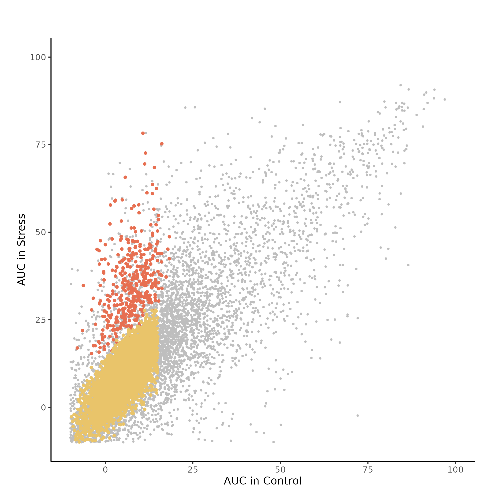
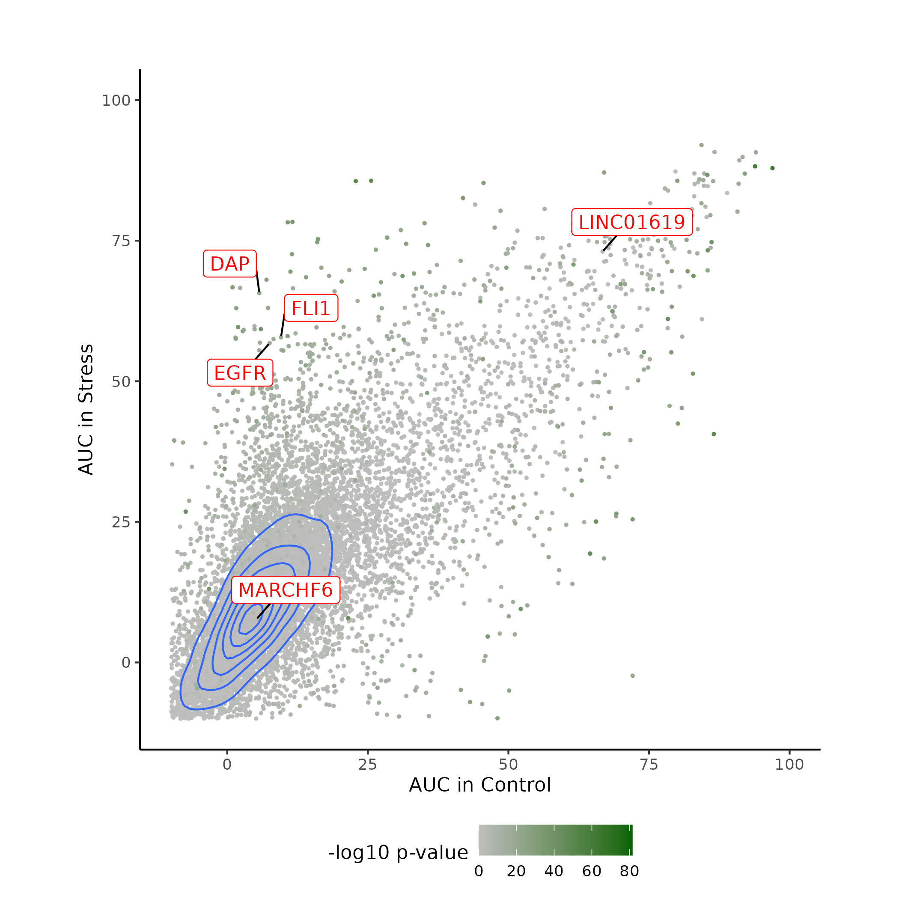
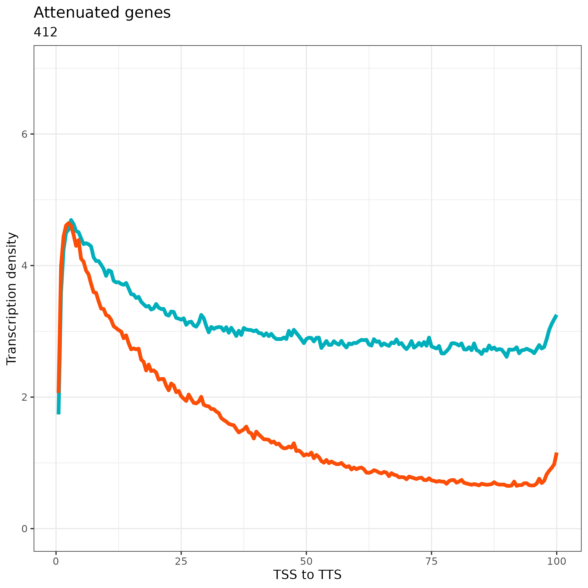
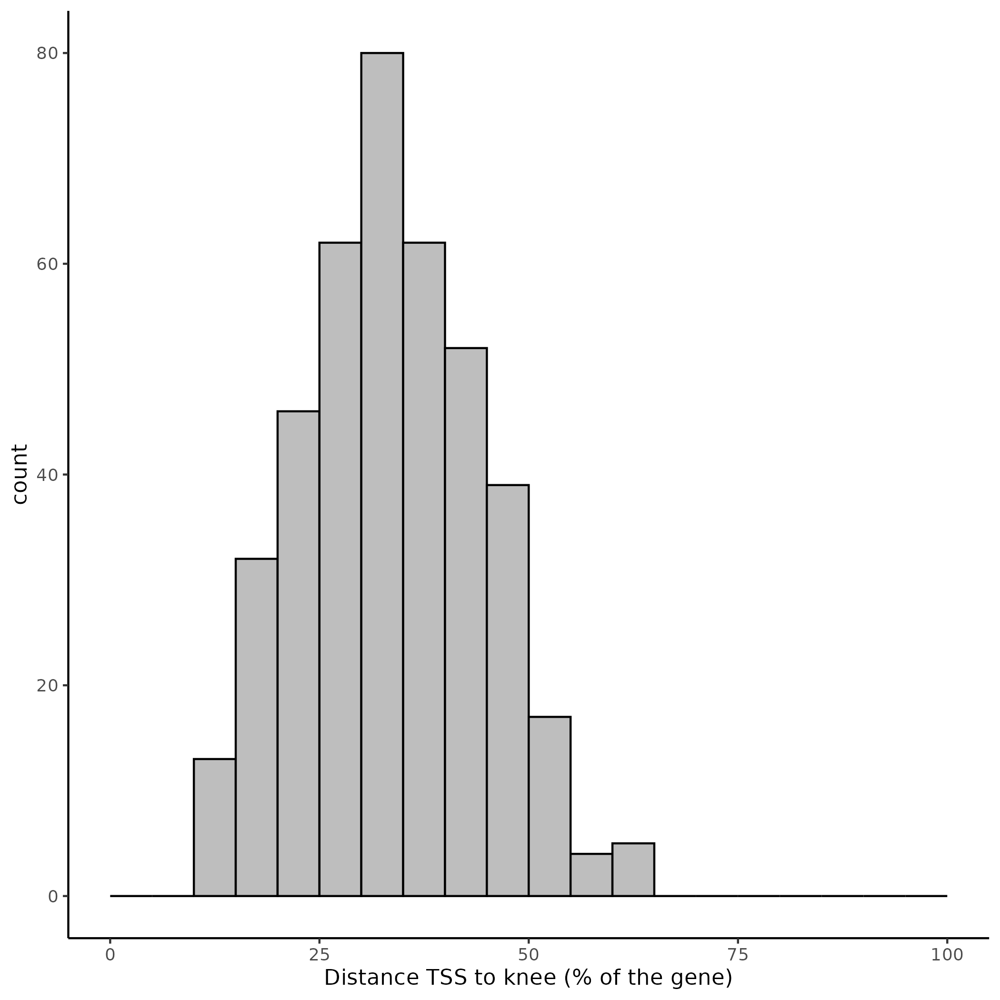
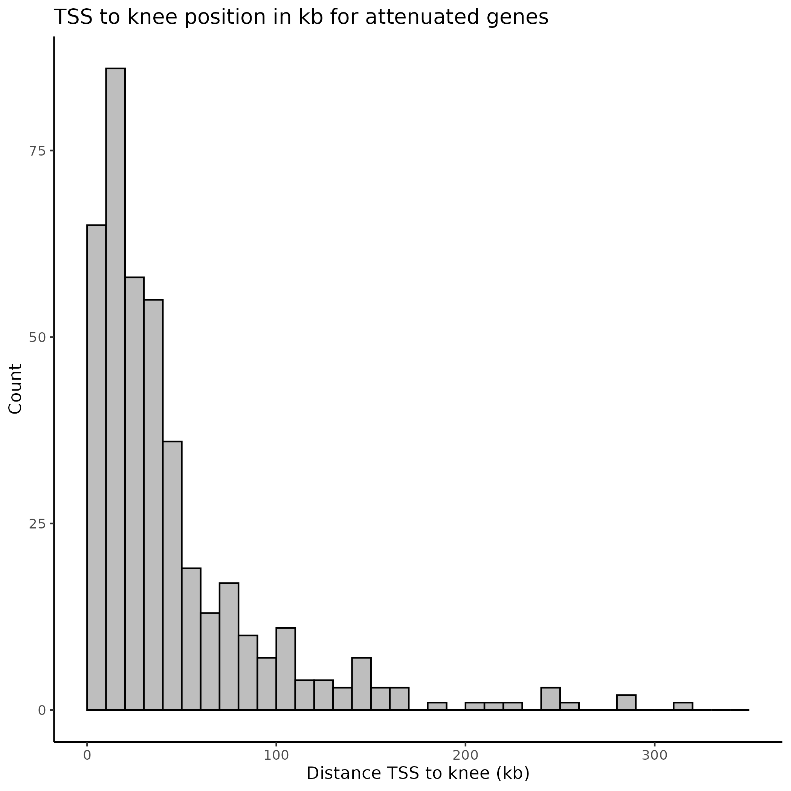

# Introduction

TepR (Transcription elongation profile in R) is a package for analyzing data
from nascent RNA sequencing technologies (TT-seq, mNET-seq, PRO-seq, etc.).
The general principle relies on calculating the cumulative signal of nascent RNA
sequencing over the gene body of any given gene or transcription unit. TePR can
identify transcription attenuation sites by comparing profile to a null model
which assumes uniform read density over the entirety of the transcriptional
unit. It can also identify increased or diminished transcription attenuation by
comparing two conditions. Besides rigorous statistical testing and high
sensitivity, a major feature of TepR is its ability to provide the elongation
pattern of each individual gene, including the position of the main attenuation
point when such a phenomenon occurs.
Using TepR, users can visualize and refine genome-wide aggregated analyses of
elongation patterns to robustly identify effects specific to subsets of genes.
These metrics are suitable for internal comparisons (between genes in each
condition) and for studying elongation of the same gene in different conditions
or comparing it to a perfect theoretical uniform elongation.

# Getting help

Please submit issues or questions on Github for a most efficient communication.

# Quick start

The example below shows a complete run of the package. The pre-processing is
done on chr13. The post-processing is limited to 100 transcripts. The command
`system.file` retrieves the file paths inside the "extdata" folder of the
package.

```{r quickstart, eval = FALSE}

library(tepr)

## Parameters
exppath <-  system.file("extdata", "exptab.csv", package="tepr")
transpath <- system.file("extdata", "cugusi_100.tsv", package="tepr")
expthres <- 0.1
windsize <- 200

## Read input tables
expdf <- read.csv(exppath)
transdf <- read.delim(transpath, header = FALSE)

## Retrieving the bedgraph paths
bgpathvec <- sapply(expdf$path, function(x) system.file("extdata", x,
    package = "tepr"))

## Replace the path column of expdf with the previously retrieved paths
## and writing the new experiment file to the current folder
expdf$path <- bgpathvec
write.csv(expdf, file = "./exptab.csv", row.names = FALSE, quote = FALSE)
exppath <- "./exptab.csv"


#########
# Pre-processing - takes ~ 7 minutes
#########

gencodepath <- system.file("extdata", "gencode-chr13.gtf", package = "tepr")
maptrackpath <- system.file("extdata", "k50.umap.chr13.hg38.0.8.bed",
    package = "tepr")
blacklistshpath <- system.file("extdata", "hg38-blacklist-chr13.v2.bed",
    package = "tepr")
genomename <- "hg38"

finaltab <- preprocessing(exppath, gencodepath, windsize, maptrackpath,
    blacklistshpath, genomename, finaltabpath = "./", finaltabname = "anno.tsv",
    showtime = TRUE)

#########
# tepr analysis - takes ~ 11 seconds
#########

reslist <- tepr(expdf, transdf, expthres, showtime = TRUE)
resmeandiff <- restlist[[1]]
res <- reslist[[2]]
```

# Data

## Description

For a complete analysis, we will use the data of [Cugusi et al](https://doi.org/10.1016/j.molcel.2022.01.007). To validate this strategy and explore the relevance of TepR metrics in uncovering gene-specific characteristics of elongation, we re-analyzed previous experiments showing that heat shock (HS) induces attenuation in human cultured cells (REF). We compared TT-seq data from HS-stressed and control MRC5-VA cells. The stressed cells were grown for 2h at 42°C, while control cells were kept at 37°C. Both samples underwent a 15-minute pulse of 4-thiouridine (4sU) labelling of nascent transcripts, followed by purification and sequencing.

## Download

The bedgraph files, mappability track and black list necessary for performing the entire analysis can be downloaded from zenodo:

```{bash raw-files, eval = FALSE}

TO DO
-----

#!/usr/bin/sh

mkdir data

wget https://ftp.ebi.ac.uk/pub/databases/gencode/Gencode_human/release_43/gencode.v43.basic.annotation.gtf.gz -P data/ && gunzip data/gencode.v43.basic.annotation.gtf.gz
wget https://github.com/Boyle-Lab/Blacklist/blob/master/lists/hg38-blacklist.v2.bed.gz -P data/ && gunzip data/hg38-blacklist.v2.bed.gz

* k50.umap.hg38.0.8.bed (k50.umap.hg38.0.8.bed) - sent by victor
* ctrl_rep1.forward.bg (ctrl_rep1.forward.bg) - sent by victor
* ctrl_rep1.reverse.bg (ctrl_rep1.reverse.bg) - sent by victor
* ctrl_rep2.forward.bg (ctrl_rep2.forward.bg) - sent by victor
* ctrl_rep2.reverse.bg (ctrl_rep2.reverse.bg) - sent by victor
* HS_rep1.forward.bg (HS_rep1.forward.bg) - sent by victor
* HS_rep1.reverse.bg (HS_rep1.reverse.bg) - sent by victor
* HS_rep2.forward.bg (HS_rep2.forward.bg) - sent by victor
* HS_rep2.reverse.bg (HS_rep2.reverse.bg) - sent by victor

```

If one would like to skip the preprocessing, the result file can be downloaded with:

```{bash cugusi-table, eval = FALSE}

TO DO
```


# Standard workflow

## Preprocessing

The preprocessing consists in the following steps:

1. Filters Gencode annotations to retrieve "transcript" annotations.
2. Differentiates between protein-coding (MANE_Select) and long non-coding (lncRNA, Ensembl_canonical) transcripts.
3. Splits transcripts into windows of size `windsize` defined by the user.
4. Processes bedgraph files to retrieve values, exclude blacklisted regions, and retain scores in high-mappability intervals.
5. Generates a final annotated table with scores derived from the above steps.

Important: The `preprocessing` function gives the possibility to store intermediate objects. This avoid recomputing steps in the case of failing because of memory or time limit. See the parameters `saveobjectpath` and `deletetmp` in `?preprocessing`. Here are indications of resources required in order to process the complete dataset:

| nb CPU | RAM | Time |
|--------|-----|------|
| 15 | 113.5 G | 3h47 |
| 10 | 78.9 G | 4h24 |
| 7 | 57.4 G | 5h27 |
| 5 | 43G | 6h58 |
| 3 | 28.7G | 9h02|


### Input files

!!

## tepr analysis

In the quick start section, it is indicated how to perform the tepr analysis in one call with the `tepr` function. Below, the different steps performed by `tepr` are detailed with the toy-data limited to 100 transcripts. For the plots, the figures obtained running the functions on the complete annotations are also provided. The complete table can be downloaded at `TO DO`. You can find a note on processing the complete dataset in section 5.12.


### Input files

Two tables are needed as input:

- **transdf**: Table obtained with the `preprocessing` function (see previous section). It contains information about each experiment along with scores, for each protein-coding and lncRNA annotations. 

- **exptab**: Table describing the experiments. It contains the columns "condition", "replicate", "direction", "strand", and "path". The column "direction" should contain the values "forward" and "reverse". The column "strand" should contain the values "plus" and "minus". You can check the conformity of the table with the utility function    `checkexptab`. 

The two tables are provided with the package and can be retrieved with the command `system.file` in the folder “extdata”. We sampled 100 transcripts from the transdf table to describe the pipeline in order to reduce computation time. 

```{r reading-anno-scores}
library(tepr)

transpath <- system.file("extdata", "cugusi_100.tsv", package="tepr")
transdf <- read.delim(transpath, header = FALSE)
colnames(transdf) <- c("biotype", "chr", "coor1", "coor2", "transcript", "gene",
    "strand", "window", "id", "ctrl_rep1.plus", "ctrl_rep1.plus_score",
    "ctrl_rep1.minus", "ctrl_rep1.minus_score", "ctrl_rep2.plus",
    "ctrl_rep2.plus_score", "ctrl_rep2.minus", "ctrl_rep2.minus_score",
    "HS_rep1.plus", "HS_rep1.plus_score", "HS_rep1.minus",
    "HS_rep1.minus_score", "HS_rep2.plus", "HS_rep2.plus_score",
    "HS_rep2.minus", "HS_rep2.minus_score")
print(head(transdf, 3))

## The second table contains information about each replicate:
exppath <- system.file("extdata", "exptab.csv", package="tepr")
expdf <- read.csv(exppath)
head(expdf)
```

You can verify the conformity of the table with the utility function `checkexptab`. Note that this verification step is also performed by `averageandfilterexprs`.

```{r checkexptab}
checkexptab(expdf)
```

### Expressed transcripts and average expression

In order to study changes in patterns of nascent RNA, the first step is to select expressed transcripts. The expression value of a gene is defined as the mean score on each strand. Scores were extracted from bedgraphs. A gene is considered as expressed if all condition means are above a given expression threshold. The threshold above which a gene is considered as expressed is set to 0.1 by default.

```{r averageandfilterexprs}
## Calculate Average Expression and Filter Transcript Data
expthres <- 0.1
resallexprs <- averageandfilterexprs(expdf, transdf, expthres)
```

`resallexprs` is a list which first element contains `transdf` with added columns such as means. The second element contains a vector of the transcripts considered as expressed. This vector will be used for further downstream analyses.

```{r exprsvec}
## Print the first 6 expressed transcripts
head(resallexprs[[2]])
```


### Count NA values per transcript and condition

During the pre-processing, scores falling in intervals belonging to the user-defined black list, low mappability regions of the genome, or chosen regions to exclude are replaced by NA. The function `countna` enables to retrieve the number of "missing" scores per transcript. This table can be used for further filtering data, for example to filter out transcripts with too many windows without score.

```{r countna}
## Count NA values per transcript and condition
rescountna <- countna(resallexprs, expdf)
head(rescountna)
```

### Compute ECDF for Genes Based on Expression Data

This function calculates the empirical cumulative distribution function (ECDF) for expressed genes across transcripts. An ECDF is an estimator of the Cumulative Distribution Function, here we use the ecdf() function from R. It creates a ECDF for each transcript, which can then be used to use the statistical power of the Kolsmogorov-Smirnov test. The ECDF enables us to answer the question: How likely is it that we would see a distibution of signals like this if these signals were drawn from a uniform probability distribution? In other words, this statistics enables to identify specific loci from where transcription signal differs significantly from a uniform density. Indeed, if the cumulative transcription density stops increasing, it means that the windows after the locus have small values (see plotecdf for a visual). In the following steps, the ECDF is used to compute the difference with the cumulative distribution (see `meananddifference`), which is subsequently used to calculate the area under the curve (AUC, see `allauc`) and the inflection point or knee (see `kneeid`).  


```{r ecdf}
## Compute ECDF for Genes Based on Expression Data
resecdflist <- genesECDF(resallexprs, expdf)
```

The genesECDF function returns a list which first element is the main table with additional ecdf columns denoted with the `Fx` prefix corresponding to the cumulative density as calculated by R ecdf() function .

```{r resecdf}
resecdf <- resecdflist[[1]]
print(head(as.data.frame(resecdf), 3))
```

The second element returns the number of windows per transcript that is set to 200 by default during the pre-processing.

```{r nbwindows}
nbwindows <- resecdflist[[2]]
print(nbwindows)
```


### Compute Mean and Differences of Scores for Each Condition

The function `meandifference` computes two types of statistics, mean values of
scores and ecdf for each replicate (if provided) and difference of mean ecdf
with the cumulative distribution respectively. The mean values between
replicates implies that one column `mean_value` per condition will be returned.
The score `mean_value` column(s) are necessary to calculate the attenuation
scores later on (see `attenuation`). The ecdf `mean_value` are used to computes
a difference with the cumulative distribution that we call *diff_Fx*. The
*diff_Fx* statistics enables to calculate the area under the curve (AUC, see
`allauc`) and the inflection point or *knee* (see `kneeid`).

The difference is defined as: *diff_Fx = meanECDF - cumvec / nbwindows*

```{r meandifference}
## Compute Mean and Differences of Scores for Each Condition
resmeandiff <- meandifference(resecdf, expdf, nbwindows)
print(head(resmeandiff, 3))
```

The result table is then splitted into a list of table per transcript. This enables to further perform operations by transcripts and to parallelize to speed up the analysis.

```{r splitmeans}
## Split the results by transcripts
bytranslistmean <- split(resmeandiff, factor(resmeandiff$transcript))
```


### Calculate Area Under Curve (AUC) and Differences of AUC for Transcript Data

The AUC values enable the comparison of the nascent-rna signal with a uniform distribution (no attenuation of signal, x = y), or the AUC of difference in signal distribution between two conditions (dAUC). The difference between cumulative densities is estimated by a Kolmogorov-Smirnov test and the adjusted p-value is also provided. Finally, results are returned by transcript along with a mean value that is called *MeanValueFull*.

For each condition (if more than one), the Area Under the Curve (AUC) of *diff_Fx* (see previous section) is computed with a trapezoidal approximation (see pracma::trapz):

*AUC = pracma::trapz(transcoord, diff_Fx)*

with transcoord being the positions along the transcript and *diff_Fx* the difference with the cumulative distribution.


```{r allauc}
## Calculate Area Under Curve (AUC) and Differences of AUC for Transcript Data
resauc <- allauc(bytranslistmean, expdf, nbwindows)
print(head(resauc, 3))
```

### Identify the Knee and Max ECDF Differences for Each Transcript

To assess attenuation in nascent-rna signal, one must identify a significant
change in the signal distribution. To acheive this, tepr identifies the maximum
*diff_Fx*. In other words, it identifies the maximum variation in the signal
"progression" of the empirical cumulative distribution (see `genesECDF` and
`meandifference`). The window where maximum change is observed is termed *knee* and is
calculated as: *knee = max(diff_Fx)*. Thus, the knee position is defined as the max difference between the ecdf and y=x curve.

The function returns the position (*Knee_AUC*) and the value (*diff_Fx*) of the
knee.

```{r knee}
## Identify the Knee and Max ECDF Differences for Each Transcript
resknee <- kneeid(bytranslistmean, expdf)
print(head(resknee))
```

### Calculate Attenuation from AUC and Other Transcript Features

The `attenuation` function calculates the mean value of all window mean scores before and after the knee location. It then provides an "attenuation score" with the formula: *att <- 100 - downmean / upmean x 100* (x for multiplication). The three values *att*, *downmean*, and *upmean* are provided by the columns "UP_mean_", "DOWN_mean_", and "Attenuation_".

```{r attenuation}
## Calculate Attenuation from AUC and Other Transcript Features
resatt <- attenuation(resauc, resknee, rescountna, bytranslistmean, expdf,
    resmeandiff)
print(head(resatt, 3))
```

### Define Universe and Group of Genes Based on Expression Data

Before further downstream analysis, the list of transcript to study must be
defined. tepr selects a transcript if it has:

1) Windows long enough
2) Not too many missing values
3) A mean expression value high enough
4) A significant Kolmogorov-Smirnov test

Analytically it gives:

```{r uniselect, eval = FALSE}
window_size > windsizethreshold &
Count_NA < countnathreshold &
meanctrl > meanctrlthreshold &
meanstress > meanstressthreshold &
pvaladj > pvalthreshold
```

What a satisfying threshold for each criterion is depends on the experiments.
The user can adjust the different threshold along the analysis. A transcript
satisfying the above criterion is defined as belonging to the `Universe` of the
transcripts to analyze (Universe column contains TRUE).

The transcripts of the Universe are further divided into `Group`. A transcript
belongs to the "Attenuated" group if:

1) It belongs to the Universe
2) The Area Under the Curve is high enough
3) The `-log10` of the adjust p-value of the Kolmogorov-Smirnov test is above threshold.

Analytically it gives:

```{r attselect, eval = FALSE}
Universe == TRUE &
aucstress > aucstressthreshold &
-log10(pvalks) > attenuatedpvalksthreshold
```

A transcript is considered as non-attenuated ("Outgroup") if:

1) The Kolmogorov-Smirnov adjusted p-value is above a threshold
2) The control AUC is between two user-defined thresholds.

Analytically it gives:

```{r outgroup, eval = FALSE}
pvalks > outgrouppvalksthreshold &
aucctrl > aucctrlthresoldhigher & aucctrl < aucctrlthresholdlower
```

Note that transcripts belonging neither to "Attenuated" nor "Outgroup" are NA.
The columns `Universe` and `Group` are computed with:

```{r universegroup}
## Define Universe and Group of Genes Based on Expression Data
res <- universegroup(resatt)
print(head(res, 2))
```


## Plotting

tepr enables the visualization of the cumulative transcription density along a
selected transcription unit (`plotecdf`); the comparison of the AUC between two
conditions (`plotauc`); the average transcription density of a user-selected
collection of transcripts (`plotmetagenes`); and of the histogram of the
distance of the knees to the transcription start sites (TSS).

### ECDF

The visualization of the ecdf distribution for a particular transcript (or gene)
can be obtained with:

```{r plotecdf}
colvec <- c("#90AFBB", "#10AFBB", "#FF9A04", "#FC4E07")
plotecdf(resmeandiff, res, expdf, "EGFR", colvec, plot = TRUE)
```

### AUC

The AUC values between conditions can be compared by highlighting the
two conditions on the plot:

```{r plotaucgroups}
plotauc(res, plottype = "groups", plot = TRUE)
```

The plot on the complete dataset gives:



It is also possible to compare the AUC by coloring points according to the
Kolmogorov-Smirnov test adjusted p-values and by indicating graphically the
points corresponding to a group of genes:

```{r plotaucpval}
genevec <- c("EGFR", "DAP", "FLI1", "MARCHF6", "LINC01619")
plotauc(res, genevec, plot = TRUE)
```

The plot on the complete dataset gives:




### Metagenes

The average transcription density along a meta-transcript or a meta-gene can be
visualized with:

```{r metageneplot}
plotmetagenes(res, resmeandiff, plottype = "attenuation", plot = TRUE)
```

The plot on the complete dataset gives:



Note that the second parameter tells to plot the distribution for the
transcripts identified as "attenuated" by the function `universegroup`. The
function also enables to select the transcripts categorized as "outgroup",
all the transcripts belonging to the "universe", or all the transcripts of the
initial table ("all").

### Histogram

One can visualize the distance of the knees from the TSS by percentage:

```{r kneepercent}
plothistoknee(res, plot = TRUE)
```

The plot on the complete dataset gives:



The distance can also be visualised in kilobases (kb) by changing the *plottype*
parameter:

```{r kneekb}
plothistoknee(res, plottype = "kb", plot = TRUE)
```

The plot on the complete dataset gives:




# Annex

## Note on processing the complete dataset

Note that parallelization is encouraged on the complete dataset. We used 20 cpus. The code below assumes that the file "dTAG_Cugusi_stranded_20230810.tsv" is in the current folder. Note that you can check the conformity of the table `transdf` with the utility function `checkexptab`. 

The time of computation for each function is indicated:

```{r completedataset, eval = FALSE}
library(tepr)

transpath <- "dTAG_Cugusi_stranded_20230810.tsv"
exppath <- system.file("extdata", "exptab.csv", package="tepr")

## Reading input files
transdf <- read.delim(transpath, header = FALSE) 
expdf <- read.csv(exppath)

## Calculate Average Expression and Filter Transcript Data
expthres <- 0.1
resallexprs <- averageandfilterexprs(expdf, transdf, expthres, showtime = TRUE)

         Calculating average expression per transcript
         Removing lines with values < expthres
                 ## Analysis performed in: 7.67012810707092 (seconds)

## Count NA values per transcript and condition
rescountna <- countna(resallexprs, expdf, nbcpu = 20, showtime = TRUE)

         Splitting the table by each transcript
                 ## Analysis performed in: 25.9511797428131 (seconds)

## Compute ECDF for Genes Based on Expression Data
resecdflist <- genesECDF(resallexprs, expdf, nbcpu = 20, showtime = TRUE)

         Filtering to keep only the expressed transcripts
         Splitting the table by each transcript
         Computing ecdf on each transcript
                 ## Analysis performed in: 1.23920369148254 (minutes)
resecdf <- resecdflist[[1]]
nbwindows <- resecdflist[[2]]

## Compute Mean and Differences of Scores for Each Condition
resmeandiff <- meandifference(resecdf, expdf, nbwindows, showtime = TRUE)

         Merging columns for condition ctrl
         Calculating average and difference between replicates for columns 'value' of ctrl
         Calculating average and difference between replicates for columns 'Fx' of ctrl
         Merging columns for condition HS
         Calculating average and difference between replicates for columns 'value' of HS
         Calculating average and difference between replicates for columns 'Fx' of HS
         Commputing all differences on mean columns
                 ## Analysis performed in: 0.953349590301514 (seconds)

## Split the results by transcripts
start_time <- Sys.time()
bytranslistmean <- split(resmeandiff, factor(resmeandiff$transcript))
end_time <- Sys.time()
message("\t\t ## Analysis performed in: ", end_time - start_time)

                ## Analysis performed in: 6.54691791534424 (seconds)

## Calculate Area Under Curve (AUC) and Differences of AUC for Transcript Data
resauc <- allauc(bytranslistmean, expdf, nbwindows, nbcpu = 20, showtime = TRUE)

         Computing the differences (d or delta) of AUC
         Computing the Area Under Curve (AUC)
         Merging results
                 ## Analysis performed in: 27.2096176147461 (seconds)

## Identify the Knee and Max ECDF Differences for Each Transcript
resknee <- kneeid(bytranslistmean, expdf, nbcpu = 20, showtime = TRUE)

                 ## Analysis performed in: 11.8020555973053 (seconds)

## Calculate Attenuation from AUC and Other Transcript Features
resatt <- attenuation(resauc, resknee, rescountna, bytranslistmean, expdf,
    resmeandiff, nbcpu = 20, showtime = TRUE)

         Merging tables
         Building summary
         Merging summary
         Merging detailed mean table with summary
         Splitting the previous table by transcript
         Computing up and down mean
         Merging attenuation to the complete table
                 ## Analysis performed in: 1.17459278106689 (minutes)

## Define Universe and Group of Genes Based on Expression Data
res <- universegroup(resatt, showtime = TRUE)

         Computing the Universe column
         Computing the Group column
                          ## Analysis performed in: 0.0214207172393799 (seconds)

## Plotting and saving to current folder
colvec <- c("#90AFBB", "#10AFBB", "#FF9A04", "#FC4E07")
plotecdf(resmeandiff, res, expdf, "EGFR", colvec, outfold = ".",
    formatname = "png")

plotauc(res, plottype = "groups", outfile = "AUCcompare_group", outfold = ".",
    formatname = "png")
genevec <- c("EGFR", "DAP", "FLI1", "MARCHF6", "LINC01619")
plotauc(res, genevec, plottype = "pval", outfile = "AUCcompare_pval",
    outfold = ".", formatname = "png")

plotmetagenes(res, resmeandiff, plottype = "attenuation", formatname = "png",
    outfold = ".")

plothistoknee(res, outfold = ".", formatname = "png")
plothistoknee(res, plottype = "kb", outfold = ".", formatname = "png")
```


## Preprocessing with bash

To perform the pre-processing steps, we provide a conda environment that can be activated with:

```{bash conda, eval = FALSE}
TO DO
```

Retrieve the protein-coding and long non-coding RNA (lncRNA) annotations from the gencode file:

```{bash protcod-lncrna, eval = FALSE}
#!/usr/bin/sh

cd data/

## Building the protein-coding bed file
grep -w transcript gencode.v43.basic.annotation.gtf | grep -w MANE_Select > MANE_Select.protein_coding.gtf
awk 'OFS="\t" {print $0}' MANE_Select.protein_coding.gtf | tr -d '";' | sort -k1,1 -k2,2n  | awk -F \t -v OFS='\t' '{print $0}' | awk -v OFS="\t" '{ print $1,$4,$5,$12,$16,$7}' > MANE_Select.protein_coding.bed

## Building the lncRNA bed file
grep -w transcript gencode.v43.basic.annotation.gtf | grep -w lncRNA | grep -w Ensembl_canonical | grep -v not_best_in_genome_evidence | grep -v 'transcript_support_level "5"' | grep -v 'transcript_support_level "4"' > Ensembl_canonical_TSL123.lncRNA.gtf
awk 'OFS="\t" {print $0}' Ensembl_canonical_TSL123.lncRNA.gtf | tr -d '";' | sort -k1,1 -k2,2n  | awk -F \t -v OFS='\t' '{print $0}' | awk -v OFS="\t" '{ print $1,$4,$5,$12,$16,$7}' > Ensembl_canonical_TSL123.lncRNA.bed

rm MANE_Select.protein_coding.gtf Ensembl_canonical_TSL123.lncRNA.gtf
```

Remove the black list and make windows for protein-coding and lncRNA files:

```{bash remove, eval = FALSE}
#!/usr/bin/sh

WORKING="."
blacklist="hg38-blacklist.v2.bed"
window=200

mkdir makewindow

## Removing black list and computes windows for protein-coding annotations
ANNOTATION="MANE_Select.protein_coding.bed"
awk -F "\t" -v OFS="\t" '{print $1,$2,$3,$4"_"$5"_"$6}' $ANNOTATION | bedtools intersect -a stdin -b $blacklist -v  | bedtools makewindows -n $window -i srcwinnum -b stdin | sort -k1,1 -k2,2n > $WORKING/makewindow/v43.MANE_protein.window${window}.bed
echo $WORKING/makewindow/v43.MANE_protein.window${window}.bed

## Removing black list and computes windows for lncRNA annotations
ANNOTATION="Ensembl_canonical_TSL123.lncRNA.bed"
awk -F "\t" -v OFS="\t" '{print $1,$2,$3,$4"_"$5"_"$6}' $ANNOTATION | bedtools intersect -a stdin -b $blacklist -v  | bedtools makewindows -n $window -i srcwinnum -b stdin | sort -k1,1 -k2,2n > $WORKING/makewindow/v43.Ensembl_canonical_TSL123.lncRNA.bed
echo $WORKING/makewindow/v43.Ensembl_canonical_TSL123.lncRNA.bed
```

For each bedgraph file, remove the black list and mappability track, and retrieve scores on the protein coding annotations:

```{bash bedgraph-protcod, eval = FALSE}
#!/usr/bin/zsh

ext="bg"
WORKING="."
window=200
umapk50="k50.umap.hg38.0.8.bed" # hg38 mappability windows with mapp k50 > 80%
blacklist="hg38-blacklist.v2.bed"

windowfiles=["makewindow/v43.MANE_protein.window${window}.bed" "makewindow/v43.Ensembl_canonical_TSL123.lncRNA.bed"]
annotationsfiles=["MANE_Select.protein_coding.bed" "Ensembl_canonical_TSL123.lncRNA.bed"]
namesvec=["protein-coding" "lncRNA"]
outputfolders=["protein_coding_score" "lncRNA_score"]

for i in ${#windowfiles[@]};
do
    echo "Processing "${namesvec[$i]}
    windowfile=${windowfiles[$i]}
    annofile=${annotationsfiles[$i]}
    outfoldname=${outputfolders[$i]}

    mkdir $WORKING/withzeros
    mkdir $WORKING/mapHigh

    for file in $WORKING/*.$ext ;
    do
        filename=$(basename "$file" .$ext);
        echo "starting file :"
        echo $filename;

        if echo $filename | egrep -q "reverse|minus" ;  then  
            strand="-"
        elif echo $filename | egrep -q "forward|plus" ; then
            strand='+'
        fi

        echo "removing blacklist region"
        bedtools intersect -a $WORKING/${filename}.$ext -b <( \
        awk -F "\t" -v OFS="\t" -v myvar=$strand '{if ($6==myvar) print $1,$2,$3,$4"_"$5"_"$6}' $annofile \
        | bedtools intersect -a stdin -b $blacklist -v) \
        | sort -k1,1 -k2,2n > $WORKING/withzeros/${filename}.nonzeros.$ext

        echo "removing low mappability region"
        bedtools intersect -a $WORKING/withzeros/${filename}.nonzeros.${ext} -b $umapk50 -sorted \
        | awk -F "\t" -v OFS="\t" '{print $1,$2,$3,".",$4}' > $WORKING/mapHigh/${filename}.0.8.$ext

        echo "scoring windows"
        bedmap --echo --wmean --delim "\t" $windowfile $WORKING/mapHigh/${filename}.0.8.$ext | awk -F "_" -v OFS="\t" '{print $1,$2,$3,$4}' | awk -F "\t" -v OFS="\t" -v name="$filename" '{ print $0,$4"_"$5"_"$6"_"$7,name}' | awk -F "\t" -v OFS="\t" '{ print "protein-coding",$1,$2,$3,$4,$5,$6,$7,$9,$10,$8 }' > $WORKING/${filename}.window${window}.MANE.wmean.name.score ;

        mkdir $WORKING/$outfoldname
        mv $WORKING/*.score $WORKING/$outfoldname/
        rm -r $WORKING/withzeros $WORKING/mapHigh
        echo "done"
    done
done
```

The package provides a `joinfiles` function to generate the final table that is used as input below. Running the function from the data folder, the default parameters can be used:

```{r mergefiles, eval = FALSE}
library(tepr)

alltsv <- joinfiles()

## Performing type conversion
idxvec <- c(8, 11, 13, 15, 17, 19, 21, 23, 25)
invisible(sapply(idxvec, function(idx) alltsv[, idx] <<- as.numeric(alltsv[, idx])))
```
